# Creating SkyUI Widgets

# Goal

In this tutorial we’re going to make a HUD widget, specifically for the
Skull of Corruption staff. In the game, this unique daedric artifact
stores “dreams” and when you use it, it shows some notification messages
about how many dreams you have used / acquired which is just… ewww.
Ugly. We’re going to spice it up, and through this you’ll hopefully
learn how to make your own hud widgets.

This is a tutorial, you’re supposed to follow it step by step, and I’ll
introduce stuff as they come up. Hopefully, it’ll be fun!

# Prerequisites

I’m assuming you know CreationKit and the basics of Papyrus. If you
don’t, I highly recommend the [Skyrim
Scripting](https://www.youtube.com/@SkyrimScripting) YouTube
channel, this is what got me started and it’s a wonderful, step by step
guide.

You’ll also need the Adobe Flash tool, Skyrim’s menus use Flash. This
program is not available to purchase anymore however, so you’ll need to
figure out how to get it on your own. Install CS6, though lower versions
work fine too. I use CS5.5 personally.

Use ModOrganizer 2 for your sanity’s sake. Install SKSE, and SkyUI.

Now in order to make HUD widgets, all we really need is SKSE, it
provides the API to manipulate the existing menus in the game or add our
own. HUD is just a menu similar to Inventory or Magic menu that you use
during game. Don’t let the “SKSE” name scare you though, all of its
beautiful API is available in Papyrus. But, we’re also going to use
SkyUI, because for HUD widgets it adds its own API, making it easier to
manage “widgets” in the HUD.

# Let’s Quest

First, let’s create a separate folder for our mod. We put all the
scripts, assets, the Skyrim plugin file in it, this’ll make packaging it
later easier. So, in MO2 right click on an empty area in the left panel
and select “Create Empty Mod”, or just navigate to your mods folder and
make a folder there. Then go to Tools \> Executables and select
CreationKit ([watch this if you haven’t
added CK to your
executables](https://www.youtube.com/watch?v=J1KBghHhrI4)), tick
the option that says, “Create files in mod…” and in the box in front of
it, select that folder you made previously. Now, when we run CK and it
generates a file, it gets put in our mod folder automatically.

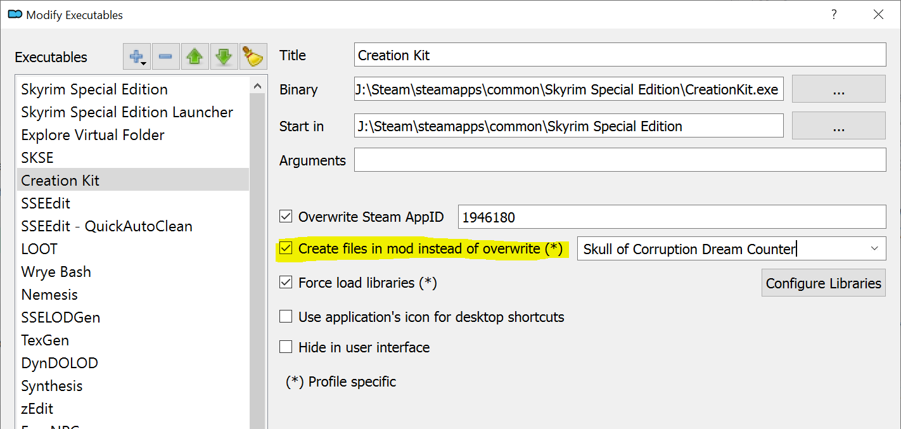

Fire up CreationKit, and add a Quest. Why a quest? Because we need to
attach our scripts to something, and quests are these ever-present
things. Add one, give it ID and a name and click OK. This is critical:
before adding anything else to the quest we have to close the window,
and then re-open it.

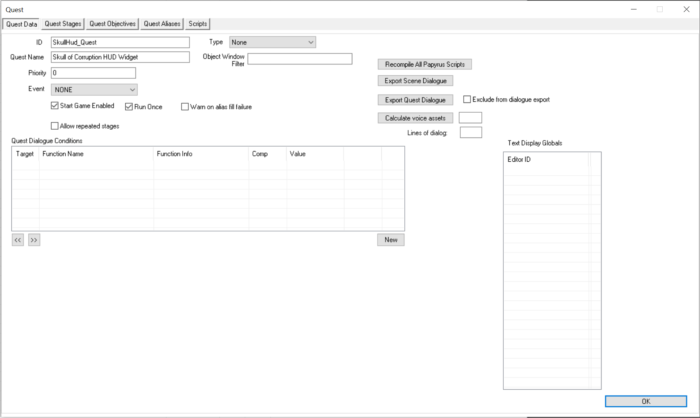

It’s preferable to prefix everything we make with a unique name (be it
objects/items we add, or scripts), this reduces the chance of conflicts
when player has other mods installed. To keep everything consistent, for
this tutorial we’re going to prefix everything with “SkullHud\_”. Thus
the quest ID becomes SkullHud_Quest.

The way SkyUI widgets work, you have to have a script. It’s in the
script that we define where our widget file is, or how to communicate
with it. Switch to the Scripts tab, hit Add button, and in the dialog
double click the \[New Script\] line. Now give it a name and hit OK.

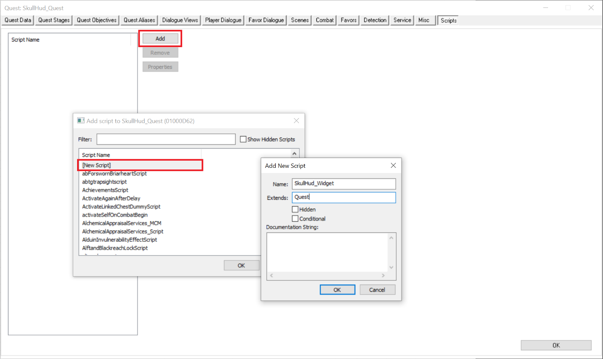

For now, we don’t need CK anymore. You can close and save your plugin.
For our scripting we switch to an external tool, my favorite editor is
Notepad++ so that’s what I use. If you want to learn how to setup your
editor to write Papyrus scripts, see the sidebar on
[CK
Wiki](https://ck.uesp.net/wiki/Category:Papyrus) page.

Now open up that SkullHud_Widget.psc file. In order to use SkyUI’s API
for Hud widgets, our script must extend the `SKI_WidgetBase` script,
this way our script inherits a lot of functionality that otherwise we’d
have to implement ourselves. So change the first line to:

`Scriptname SkullHud_Widget extends SKI_WidgetBase`

And attempt to compile. Most likely, the compilation will fail. This is
because the compiler is not familiar with `SKI_WidgetBase` so we need to
add it.

# SkyUI SDK Setup

Download the [SkyUI
SDK](https://github.com/schlangster/skyui). This has the source
files for SkyUI, including all the Flash .fla source files but we don’t
need those for our widget. All we need are the .psc Papyrus sources so
we can compile our scripts. So copy everything in the dist/Data/Scripts
and install it like any other mod. You also need to let your compiler
know of this folder path too, this depends on your setup but if like me
you’re using the Notepad++ tool you can just go to Plugin \> Papyrus \>
Settings and in the Skyrim SE tab, add that directory:

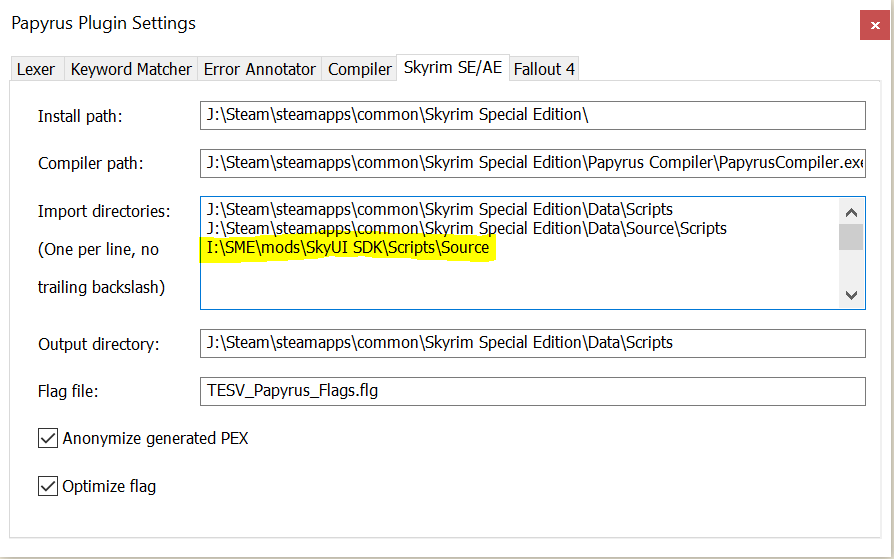

Now you should be able to compile your script fine.

# Setting up the widget

At the moment, this widget doesn’t do anything, we have to tell SkyUI
what .swf file holds our widget. So, update the script file with:

    Scriptname SkullHud_Widget extends SKI_WidgetBase
    
    String Function GetWidgetSource()
        Return "SkullCounter.swf"
    EndFunction
    
    String Function GetWidgetType()
        Return "SkullHud_Widget"
    EndFunction

Because our script extends `SKI_WidgetBase` we inherit a lot of built-in
functionality to control how our widget is displayed, or even
communicate with it and send and receive data to/from it. But that comes
later; for now we have two methods: the `GetWidgetType()` which should
return the file name of our script without the .psc extension, and the
`GetWidgetSource()` must return the name of the Flash .swf file we want
to show. I’ve put “SkullCounter.swf” here. We haven’t made it yet. So
first compile this script and let’s go do that next.

# Flash time!

The way I organize my files, I put all the Flash-related files in a
folder called “Fla” inside the mod, it’s not a rule or requirement
however. Fire up Flash, go to File \> New and select ActionScript 2.0
document:

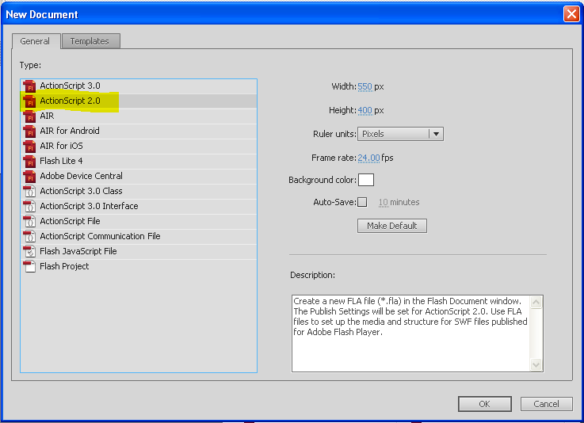

This is important because the software that renders Flash in Skyrim
(it’s not Flash Player, rather it’s called Scaleform) does not support
ActionScript 3 (sadge). Now save up the file inside the your_mod/Fla
folder.

SkyUI expect our .swf file to be in a specific directory. When we launch
the game, it looks for our widget inside “interface/exported/widgets”
folder, so in your mod create a similar folder structure:

We would need to copy the .swf file to this folder everytime we made a
change, so instead of doing that, go to File \> Publish Settings and
disable the “HTML Wrapper” tickbox (we don’t need that), make sure
“Flash (.swf)” is selected and in the Output File put:

../interface/exported/widgets/SkullCounter.swf

This means anytime we publish our movie (=\> export our Flash to .swf)
the resulting file is saved into one directory higher (remember our .fla
file is housed in mod/Fla folder, so /interface folder would be one
directory higher), then in “interface/exported/widgets”.
SkullCounter.swf is the name we set in `GetWidgetSource()` in our
script.

Now, draw something on the stage (the white box surrounded by the grey,
anything you put on stage is visible in our movie). Finally hit Ctrl +
Enter, or F12, or go to File \> Publish Preview \> Flash. Doing that,
will publish your movie and put the resulting .swf file into the
directory we specified earlier. You can close the Flash Player which
shows a preview of the movie.

Make sure your mod is active and launch the game. Use the
[“coc” console
command](https://elderscrolls.fandom.com/wiki/Console_Commands_(Skyrim)/Locations)
teleport to a location and load the game, like “coc riverwood”, or “coc
whiterun”. Your little drawing is now in the game! This little practice
gives you a sense of scale, how bigger or smaller does your drawing show
up in game.

We have a little problem however. When you do load into the game there’s
a little popup message that says,
“something something must extend a
base script type.” What’s that about? Let’s fix that.

# Fixing the noisy popup

SkyUI has two types of Hud widgets you can create, one that is unique
and one of a kind, and one type that displays multiple instances. Think
for example the active magic effects like healing icon you see when you
drink a potion, or damaging icons you’re poisoned, they show up multiple
times because you can have multiple effects active at the same time,
whereas your health bar for example, is unique and just one of it
exists. To differentiate between the two, you must set a “property”
([using properties in Skyrim
scripting](https://www.youtube.com/watch?v=Ar-M7shTc6w)) on your
widget to indicate what type it is. So, fire up CK and load up your
plugin, then edit your quest, go to Scripts tab and select the
Properties button. Find the property named “RequireExtend” and hit Edit
Value button. This sets its value to False, which is what we want.
Meaning: our widget does not “require extending” to work, it’s a unique
widget that works on its own.

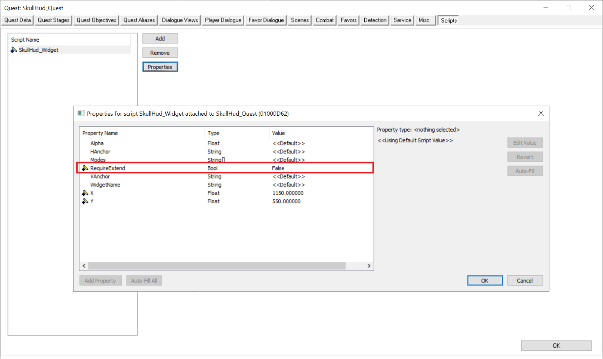

> **Error encountered while attempting to reload the script.**
> 
> If you get this error message while trying to edit the properties of
> your Quest script, it means CK is unable to compile your scripts in
> order to find what properties it has. In this case, likely cause is CK
> is unable to find the compiled files from SkyUI since our script extends
> `SKI_WidgetBase`. This is easy to fix,
> [extract BSA
> file](https://www.youtube.com/watch?v=NNnehBsaG-I) from SkyUI,
> then relaunch CK. It will fix the issue.
> 
> Now when you load up into the game, no more annoying popup!

While you’re editing the properties, set the WidgetName too, this can be
used by other plugins (for example mods that manage Hud elements). You
might notice, there’s an X and Y properties too, we can set where on
screen our widget appear. Try setting both values to a random value like
500 and check in game. You’ll notice, they don’t actually work and your
widget stays where it was. That’s something we’ll fix later on.

# Designing the Hud widget

My idea for the widget was to show a little icon that was visible
half-way, and when the player fills up the Skull of Corruption or
consumes a “dream” by casting the staff on an enemy, the widget would
“fill” up or down. I had the good fortune to have
[komegaki](https://www.nexusmods.com/skyrimspecialedition/mods/116713)
make an icon for me, the .ai icon file is inside the tutorial .zip file
so if you’re following along, import that into Flash.

The icon is supposed to be white in game, so for our authoring time, we
change the background to something else, just so we can see what we’re
doing. Go to Modify \> Document and change the Background Color option.
This won’t affect the widget however, note that our widget when it’s
displayed in game doesn’t have the background color at all so it doesn’t
matter what color you set here.

After import, right click on the icon and select Convert to Symbol. Make
sure Type is set to Movie Clip, give it name like “Skull Graphic” and
hit Ok. Now you may think nothing’s changed, but what has happened is
Flash has made that shape into a “symbol” and put an instance of it on
the stage. “Symbols” are the stuff inside Library panel (if you don’t
see it, go to Window \> Library to open its panel), “instances” are what
you put on stage. A symbol can have a lot of instances, with different
properties. The Skyrim analogy of this is Actors and ObjectReferences,
Actors are “symbol”s, in the game’s database (=\> Library) but in order
to display them in game you have to make an ObjectReference of it (=\>
instances) which have their own properties, like scale, position in the
world, etc. The point of all of this is; by putting our graphic into
Library we can reuse it multiple times. Later on, if we want to change
the shape of the icon, we need to edit it just once in our “Skull
Graphic” MovieClip, and any instances of it is automatically updated.

Now, here’s an insider tip. It would make our job a lot easier down the
line, if everything we make for our widget would be inside a MovieClip.
In fact, SkyUI’s API expects us to have that, so once again, select the
instance on the stage, right click on it and hit Convert to Symbol, this
time call it “Skull Widget” and hit OK. By doing this, we have a
MovieClip that is inside another MovieClip.

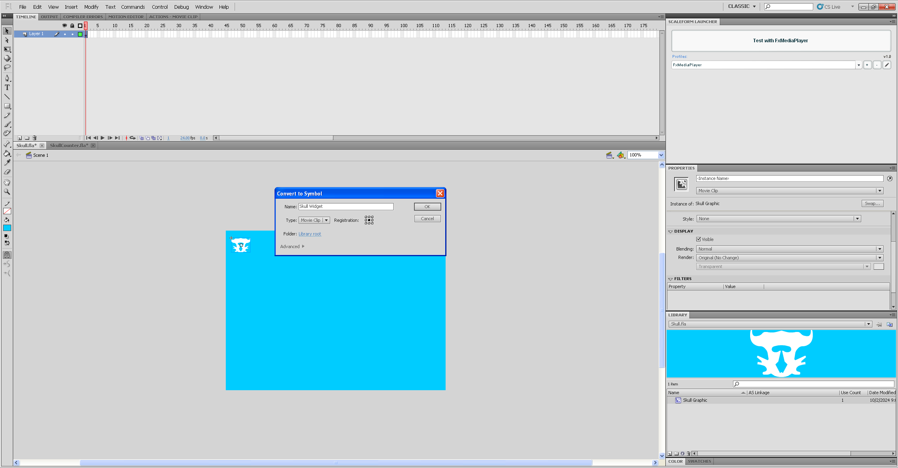

Now we want to edit our MovieClip. Two ways to do it, you can double
click on the instance on stage, this preserves everything else on stage
as barely visible (though we don’t have anything at the moment), the
alternative is to go to Library and right click on a symbol then hit
Edit, doing it this way hides everything else on stage.

Regardless of what method you use, **always**, **always**, be mindful of
where you are in your movie. You can have movieclips inside movieclips
inside movieclips, going on and on. It’s important to know what you’re
actually editing. Always keep an eye on the address bar:

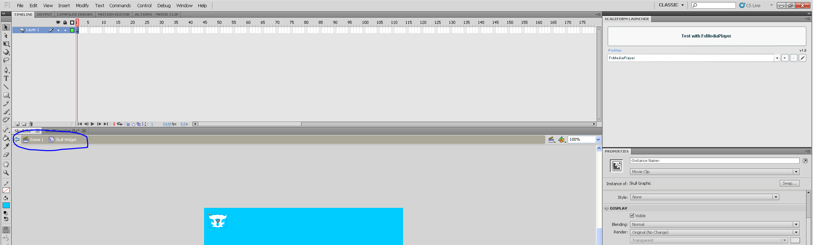

Now we’re not on “Scene 1” anymore, we’re editing Skull Widget symbol.
This is where we make and design our widget.

Next, click the instance on the stage and in Properties panel, under
Color Effect, select Alpha and set the slider to 50. This makes this
instance half-visible.

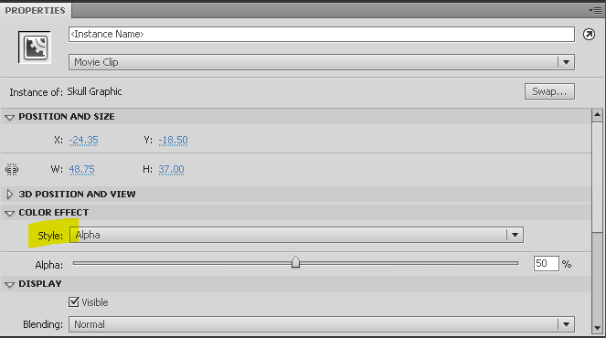

Next, copy the instance on the stage, click New Layer in the Timeline
panel, make sure the new layer is selected, then hit Paste in Place.
Timeline is where we make and edit our animations and also manage
layers, usually sitting above stage. If you don’t see it, go to Windows
to activate its panel.

In Flash, every instance that needs animating must be on a separate
layer. Select the instance on the select layer, and set the Style option
to None. Remember, our widget by default is half visible, so we need one
instance that is always visible at 50% opacity regardless of whatever
else is displayed, and we need a new instance of it at full opacity, but
control how much of it is displayed. That we can do through Mask Layers.

Add a third layer above the two we already have. For safety, you can
lock the two other layers so we don’t accidentally select them or edit
them. This is what our Timeline looks like now, I’ve highlighted the New
Layer button and the lock layer tool:

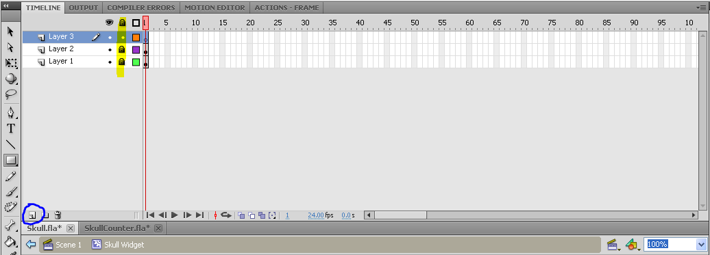

In this new layer, draw a thin rectangle just below the icon. Its color
doesn’t matter, since it won’t be actually visible, just make sure it’s
barely touching the bottom of the icon:

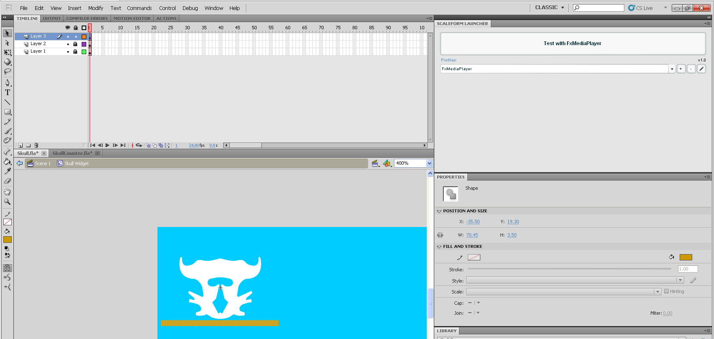

At this juncture, we must get familiar with some concepts.

**Frames**

Frames are the building blocks of an animation. When you’re watching a
movie or an animation, what you’re actually seeing is a whole bunch of
static images that flip and switch so fast that your eyes perceive them
as moving. Every one of those static images is a “frame”. In Flash, if
you look at Timeline you see a whole bunch of little square blocks,
those are frames. Every layer has its own, separate frames that you can
control.

**Keyframe**

Keyframes are where a change happens. Flash has multiple kinds of
frames, but when we want to make a change happen, we have to make a
“keyframe”. In Flash keyframes have a little black circle in them,
indicating there’s some change to what’s in that layer.

Now in Timeline right click on frame 100 and hit Insert Keyframe. Why
100? Because we want to represent the icon at various stages of
“filled”, and 100 is a perfect round number, we can calculate
percentages \[0 to 100\] regardless of what value they represent, so it
works great for our purpose.

But wait, oh no, everything disappeared!

Don’t worry though, they’re still there. It’s just that by frame 100,
the Layer 3 has frames so anything in that layer appears in the stage
(and thus in the finished movie) but since the other two layers don’t
have frames, they don’t. Easy fix, right click on the frame 100 on the
other two layer and select “Insert Frame” to make them show too. We
inserted “frame” here and not “keyframe” because we don’t need to change
anything in those two layers; since they don’t change, they don’t need
keyframes.

Now make sure you’re still on frame 100. In Timeline you can move
between frames by dragging the red marker around. So, in frame 100,
select the Free Transform tool, and make the square box cover up the
icon. This is what it should look like now:

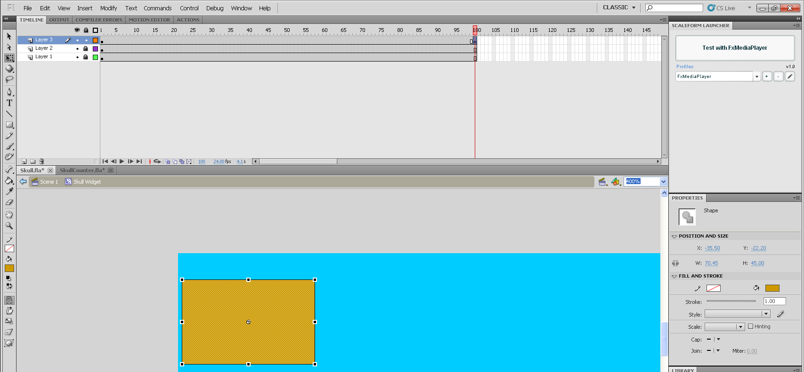

Our box has two frames, one where it is small (frame 1), one which is
big (frame 100). Now we want Flash to animate between these two states.
In Timeline, right click anywhere on Layer 3 between frame 1 and 100 and
select Create Shape Tween:

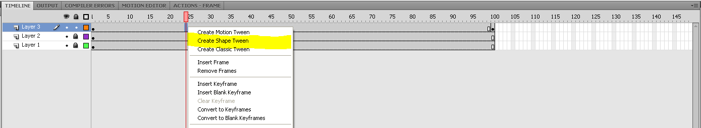

You see a green bar appear between those two frames. Well done, it’s now
animated! The box slowly covers the icon from bottom to the top.

# Tweening

What was that “shape tween”? The word “tween” comes from “between”,
meaning we give Flash two **keyframes**, and Flash will build the frames
in between those two. There are two types of Tween animation:

  Shape Tween: this is your only option when you want to make an
  animation where one shape converts to another shape.

  Motion Tween: anytime we want to animate an instance’s properties,
  like its location or size or effects applied on it.

  Classic Tween: the old version of Motion Tween. The new Motion Tween
  offers a lot more control over the animation, so there’s really no
  reason to use this.

If you want to convert a shape (say, a square) to another shape (say, a
circle), you have to use Shape Tween. Otherwise, Motion Tween would be
the better choice. Shape Tweens are heavier on the rendering, but our
shapes are similar enough (a thin square, to a thick square) that it
doesn’t matter. Tween animations have a couple of rules that you must
follow, otherwise Flash gets cranky with you and your animation breaks.
First, for both types of Tween animation, every animation must be on a
separate layer. You can’t have more than one thing on the layer that you
want to animate. The other rule is, for Motion Tweens you have to have
an instance on stage, so it must be an instance of a symbol in the
library. For Shape Tweens, it’s the opposite and what you’re trying to
animate must not be an instance. Just to emphasize, if you don’t follow
these rules your tween animation doesn’t work and Flash will show a
dashed line in the Timeline (whereas you see an arrow pointing between
the starting keyframe and end keyframe if it’s working as it should.)

Now for the magic of masking. Right click on Layer 3 and hit Mask. This
action changes the type of that layer to “Mask”, and the immediate layer
below it to “Masked”. In Timeline you can see the “Masked” layer has an
indent:

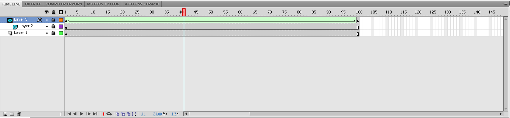

Whenever both the mask and masked layers are locked, in Flash you can
just drag the red marker around and see a preview of your work. Or
simply hit Ctrl and Enter and watch as the half-visible icon gets slowly
filled up! Well done us! If you recall this also publishes the SWF file,
so you can go in game and watch the animation play.

# ActionScript is fun!

Flash movies start at frame 1, it plays how many frames it has and when
it reaches the end, it loops back to the beginning. This is not our
desired outcome, we want the widget to show up, then based on the
percentage that the Skull of Corruption is filled, jump to a certain
frame where it matches that percentage. So first step, let’s stop Flash
from running the movie, and for that we need ActionScript. ActionScript
is the scripting language of Flash, if you’re familiar with JavaScript
or other ECMAScript-based languages, you’ll feel right at home.

You can add scripts to either frames (which are executed when your movie
reaches that frame), or MovieClips and Buttons (two types of symbols).
Since we want to stop the movie at frame 1 until we decide otherwise, we
want to add an script to a frame.

I like having a separate layer for the frame scripts. So, add a new
layer above others, rename it to Scripts and on the first frame, right
click on the frame and select Actions. This brings up the Actions panel
(notice the “- Frame” suffix, indicating we’re adding scripts to a
frame. Be mindful of where you’re adding the scripts). From here click
the blue + button, select Global Functions \> Timeline Control \> Stop:

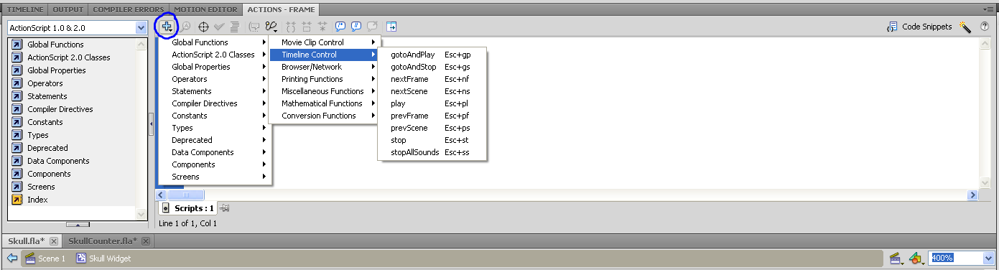

This writes the script we need to stop the movie:

    stop();

Now when you run the movie (Ctrl + Enter), it stops at the first frame.
See, told you it was easy!

You might want to browse the methods and commands that Flash has to
offer, either by clicking that + button or by exploring the book icons
on the left.

If we want to write more complex code, the better option than attaching
it to a frame or a symbol instance would be to load it from an external
file. Let’s see how. In Library, right click on the Skull Widget symbol
(remember, this was the symbol that contained everything else, including
the animation) and hit Properties. Make sure the Advanced options are
showing, then tick the “Export for ActionScript” option:

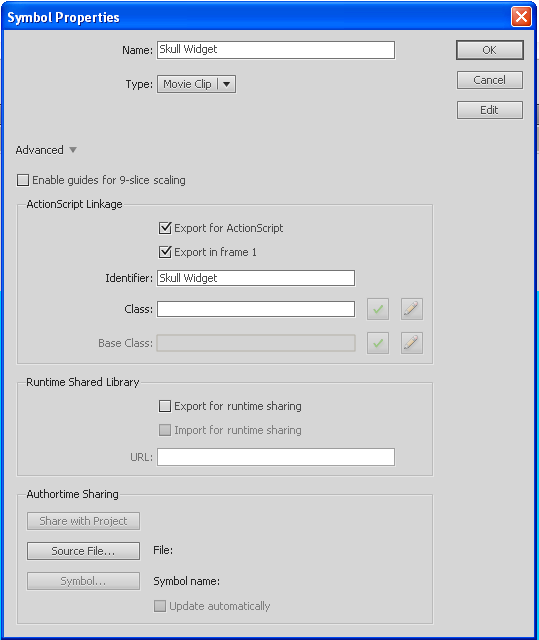

It fills the Identifier field automatically, this is used by certain
commands (like `attachMovie`), but the important one is Class, here we
can give it a unique name and have our MovieClip load its own script
file. So after giving it a class (I chose, “SkullOfCorruptionCounter”)
hit OK and save. Now, in the folder where our .fla file is, add a a file
called “SkullOfCorruptionCounter.as” and inside it type:

    class SkullOfCorruptionCounter extends MovieClip {
        function SkullOfCorruptionCounter() {
            _visible = false;
        }
    }

Now save. This class as you see “extends” the MovieClip base, meaning it
will inherit all the functionalities that MovieClips have. The function
that is the same name as the class is called “constructor”, this
function is automatically called when our MovieClip loads. The
“`_visible`” is a property of movieclips, it allows you to toggle the
visibility of that movieclip (`false` meaning don’t show, `true` meaning
show). So now if you rerun the movie, the widget is hidden, you actually
don’t see anything.

# SkyUI’s widget ActionScript class

As mentioned before in Papyrus we have control over our widget via the
API it offers, but in order to utilize that our ActionScript has to
implement SkyUI’s widget features too. Do you recall the
[SkyUI
SDK](https://github.com/schlangster/skyui) we downloaded earlier?
Grab the src/ HUDWidgets folder and put it somewhere on your PC, then
copy the path to that folder. In Flash, go to Edit \> Preferences \>
ActionScript tab, then hit ActionScript 2 Settings button. In the window
that opens, click the + button, paste the path to the HUDWidgets folder
you copied earlier and hit OK.

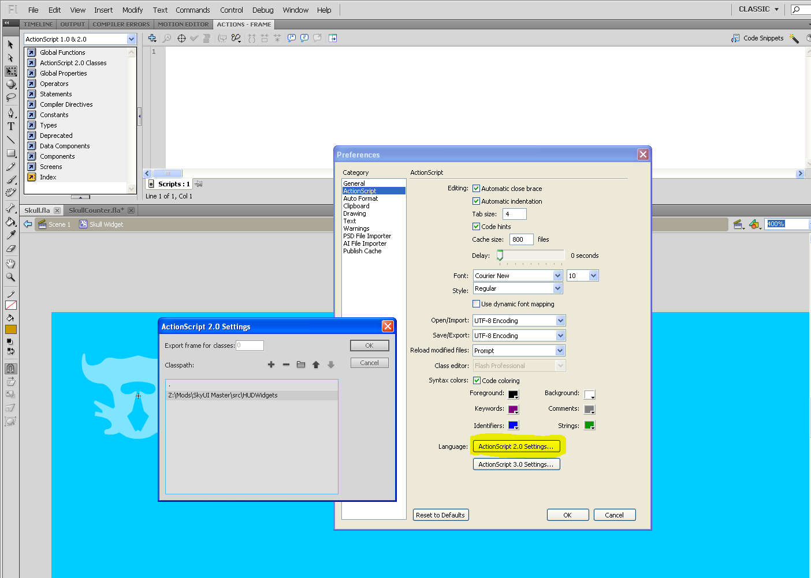

By adding the path to that folder here, anytime, from anywhere in our
ActionScript we can “import” those scripts so they’re accessible for us
to use. Back in the SkullOfCorruptionCounter.as file, change the script
to:

    import skyui.widgets.WidgetBase;
    
    class SkullOfCorruptionCounter extends skyui.widgets.WidgetBase {
    }

As you see, we first import SkyUI’s `skyui.widgets.WidgetBase` class,
then make our widget extend it, by doing so SkyUI can talk to our widget
from Papyrus (so can we!). We removed the bit that hides the widget by
default, we’ll add that later.

One last step that we have to do. In Flash, if you’re editing the Skull
Widget double click anywhere on stage where there isn’t anything, or
just click the Scene 1 button in the Address Bar to go back to the root
of our movie. Now click on the instance on stage (it should have a blue
outline), in Properties panel make sure you have the instance of Skull
Widget symbol selected, and give it the name “widget”. This is crucial,
SkyUI is coded such that widgets must have this name, and this is the
reason we put everything from our widget inside one MovieClip.

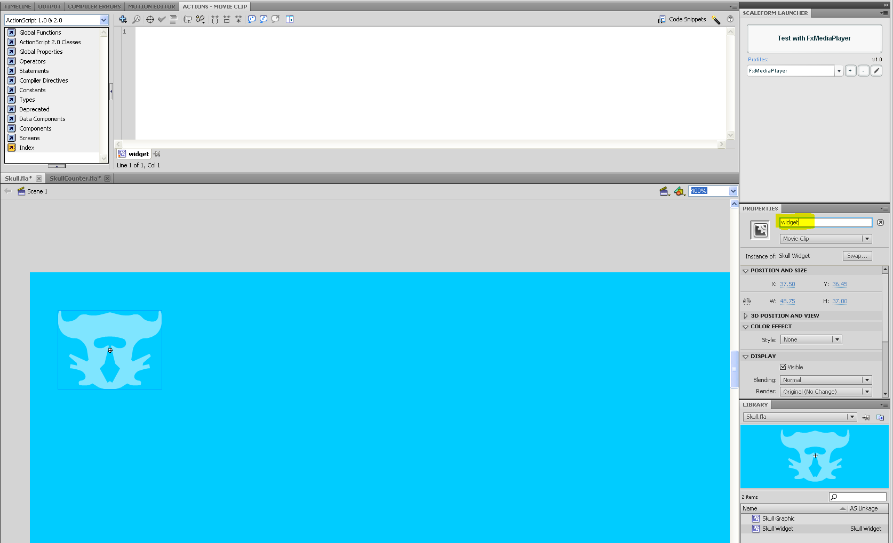

That’s it, if you run the movie now you’ll notice nothing shows, but
don’t worry, that’s a sign that our SkullOfCorruptionCounter class is
actually working correctly. After publishing the movie, go in game and
make sure the widget shows up.

# Adjusting the widget position

Now fire up the CK, load the plugin and edit the Quest, and in
Properties adjust the X and Y properties, then save. Load up the game
and see this working.

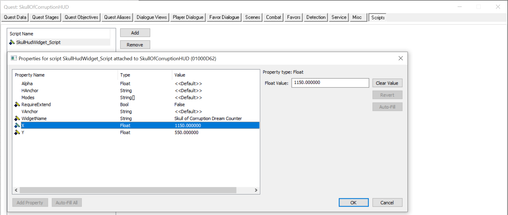

Because our ActionScript now inherits SkyUI’s `WidgetBase`, SkyUI’s
Papyrus API can “talk” to our Flash widget, so the X and Y properties we
set now functions as expected.

So, what values should be set for X and Y? For X, you can set a value
from 0 to 1280, and for Y you can set a value from 0 to 720. That’s the
display size of the menus in Skyrim, regardless of what size your Flash
is set to, it’s squished or resized in order to fit into that size. For
Ultrawide monitors this is different and the X goes from 0 to 1720 (Y is
the same). So in this case since I want my widget to show in the bottom
right corner of the screen, I gave 1150 for X (so near the right edge of
screen) and 550 for the Y (near the bottom).

`Alpha` is also one of properties, so in our script we can set it to a
desired value (between 0 and 100) and have our widget show at that
opacity. This gives us the ability to toggle our widget, we can set the
Alpha to 0 to hide it, 100 to show it. Note that this is different from
the Alpha we set in our Flash, this applies to the entire widget, not
just a certain MovieClip.

# Papyrus and ActionScript Communication

At the moment, our widget is always visible on screen. We want the
widget to show when player is actually using the Skull of Corruption
staff, otherwise it serves no purpose and should go away. So let’s do
that next.

There are multiple ways to detect when player has that staff equipped,
but for our purposes we can simply attach an script to the weapon
itself. So in CK, find the weapon and edit it, then under Scripts
section add a script for it (I named it SkullHud_WeaponScript). Now in
our weapon script we must have a way to reference the widget, to tell
that widget: “now show”, or “now go away!”. To access our widget, add a
Property and set the Type to Quest, then fill it with the Quest object
that has your widget script. I gave it “SkullHUD” name:

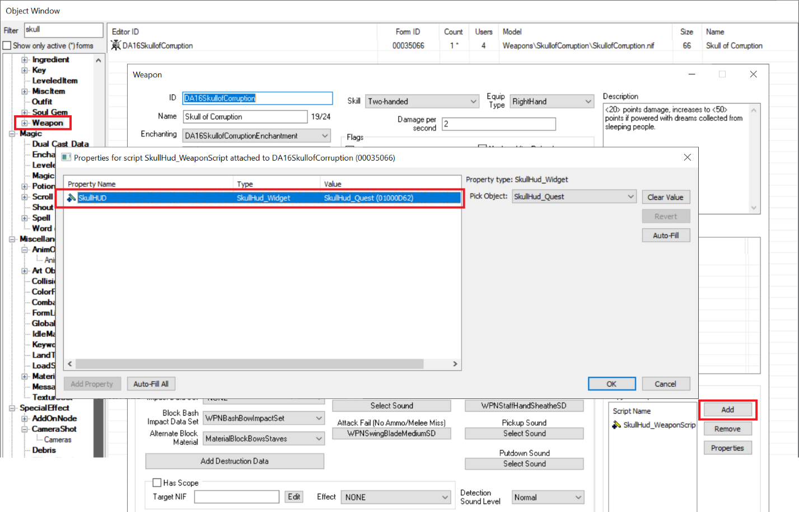

Through this Quest property, we’ll access our widget.

Now save and close CK. Back in your editor, this is what your script has
at the moment:

    Scriptname SkullHud_WeaponScript extends ObjectReference
    
    Quest Property SkullHUD Auto

Now add this:

    Event OnEquipped(Actor akActor)
        If akActor == Game.GetPlayer()
            ; player has equipped the staff
        EndIf
    EndEvent

    Event OnUnequipped(Actor akActor)
        If akActor == Game.GetPlayer()
            ; player has unequipped the staff
        EndIf
    EndEvent

You can verify the script running by adding a Debug.notification() call
in those two events. The `akActor == Game.GetPlayer()` check is
necessary because player might give the staff to a follower or drop it
somewhere and an NPC could pick it up, in such a case we don’t want to
show the widget as it would have no use for player. Moment of truth, how
can we access our widget?

Quests in Skyrim can have multiple scripts attached to them, each having
their own methods and properties. So If you type:

    SkullHUD.Alpha = 0

That results in an error because Alpha is not a thing on the quest, it’s
on a script attached to that quest. To get the script, we must **cast**
that Quest property as the script, change:

    Quest Property SkullHUD Auto

To:

    SkullHud_Widget Property SkullHUD Auto

Now we have access to the methods and properties of the
`SkullHud_Widget`! The game “cast”s that Quest object as the script we
wanted. Works like magic! So now the whole script becomes:

    Scriptname SkullHud_WeaponScript extends ObjectReference
    
    SkullHud_Widget Property SkullHUD Auto
    
    Event OnEquipped(Actor akActor)
        If akActor == Game.GetPlayer()
            SkullHUD.Alpha = 100
        EndIf
    EndEvent
    
    Event OnUnequipped(Actor akActor)
        If akActor == Game.GetPlayer()
            SkullHUD.Alpha = 0
        EndIf
    EndEvent

We can also use the `FadeTo()` method for our widget, this also adjusts
the Alpha but animates the transition. The method expects two values,
first is the Int value of fade (from 0 to 100) which the widget’s alpha
will transition to, next is the Int value of how long the animation will
take. So if you call:

    SkullHUD.FadeTo(0, 1)

The widget will fade away (alpha 0), over 1 second.

We should hide the widget by default. SkyUI gives us the
`OnWidgetReset()` method, this is called when the game loads and SkyUI
wants to show the widget, so we can use this to hide it. Back in
SkullHud_Widget.psc script file, add the `OnWidgetReset()` method:

    Event OnWidgetReset()
        Parent.OnWidgetReset() Alpha = 0
    EndEvent

The `Parent.OnWidgetReset()` call ensures everything that SkyUI was
doing to initialize the widget is still called properly.

Before you go in game, install [Easy
Console
Commands](https://www.nexusmods.com/skyrimspecialedition/mods/122895)
mod to make your life easier. Go in game, use `help “skull of” 4`
command to get a list of items with “Skull of” in their name, click on
the WEAP record to generate the command and click enter. This adds the
Skull of Corruption to your inventory. Equip it, see the widget appear
and unequip the staff to see it disappear. Wonderful!

# Separation of Concern

This works fine; however, we shouldn’t change the Alpha directly. I’m a
big fan of Separation of concerns (SoC) principle, which means every
piece of code must concern itself with the specific job it has. Our
weapon script shouldn’t concern itself with “how” we make the Skull Hud
visible or invisible (in this case the “how” is we’re manipulating the
Alpha property), it should just request that thing to happen. So
instead, we add methods to our widget to show or hide it, then other
scripts can call it and not concern themselves with how it’s done. The
advantage of this is later on we might have multiple scripts that
manipulate the widget’s visibility and when we change “how” that thing
is done, we don’t have to update multiple scripts to achieve it. Makes
sense?

So in `SkullHud_Widget` we add the methods to show and hide the widget:

    Function Show()
        Alpha = 100
    EndFunction
    
    Function Hide()
        Alpha = 0
    EndFunction

And in `SkullHud_WeaponScript` we can call it with `SkullHUD.Show()` and
`SkullHUD.Hide()`. Perfect.

We have a small issue however. If the player has the staff equipped,
saves the game and then loads that save, the widget is not there. This
is because upon loading the OnWidgetReset() is called, and it hides the
widget. We need to perform a check and if the player has the staff
equipped not hide the widget. So, in CK edit your quest, edit the
properties for the widget script, and add a new property, set the Type
to Weapon and give it a name (I prefer naming properties the same as the
object they’re referencing so I named this “DA16SkullofCorruption” as
that’s the weapon’s Editor ID) and fill it with the staff:

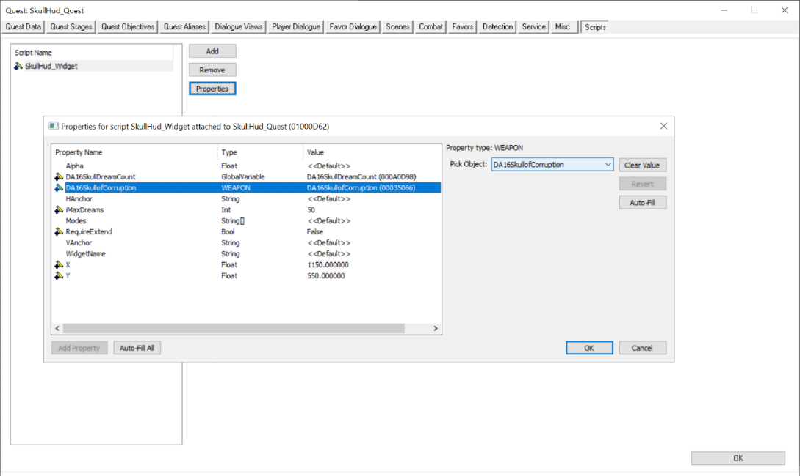

Back in the script, adjust the `OnWidgetReset()`:

    Event OnWidgetReset()
        Parent.OnWidgetReset()
        If Game.GetPlayer().IsEquipped(DA16SkullofCorruption)
            Alpha = 100
        Else
            Alpha = 0
        EndIf
    EndEvent

Recompile and check in game.

> **Caution**: when you add new properties
> to scripts or adjust an existing property, you have to use a new save.
> Don’t hit Continue on the main menu or load an existing save. New
> properties that you add are not filled in when you load an existing
> save. So use the COC command to start again on a new save, or however
> other method you prefer to start a new save (like Alternate Start mods).

# Papyrus and ActionScript Communication ++

Now our widget shows whenever we equip the staff which is wonderful, but
it doesn’t actually show how much the staff is filled with dreams. When
you cast the staff on an sleeping enemy, the staff is charged and when
you cast on a non-sleeping enemy the charge is used to apply damage to
that enemy. We need our widget to update and reflect this.

First let’s find where this action is happening in the first place. When
you use the staff there’s a notification message that says, “X dreams
remain in the Skull of Corruption.”, we can use that to search where the
game is calling that notification. In CK go to Edit \> Find Text and
search for “dreams remain in the Skull of Corruption”:

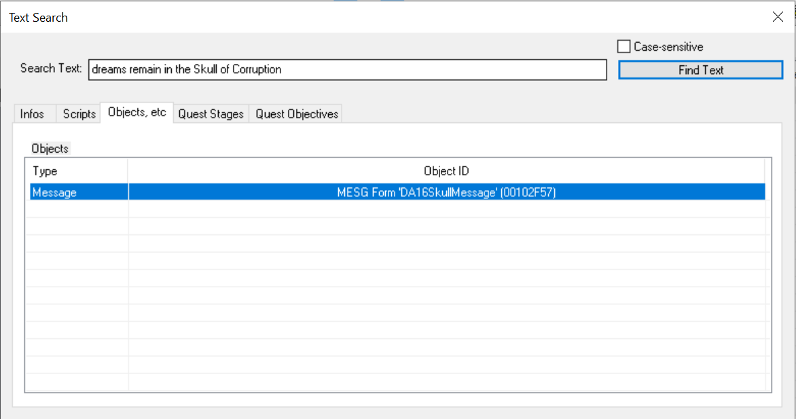

Under Objects we see that’s a Message with the ID of DA16SkullMessage.
So search in Message objects for that ID, then right click on it and
click on Use Info, this will show all the places where this message item
is referenced:

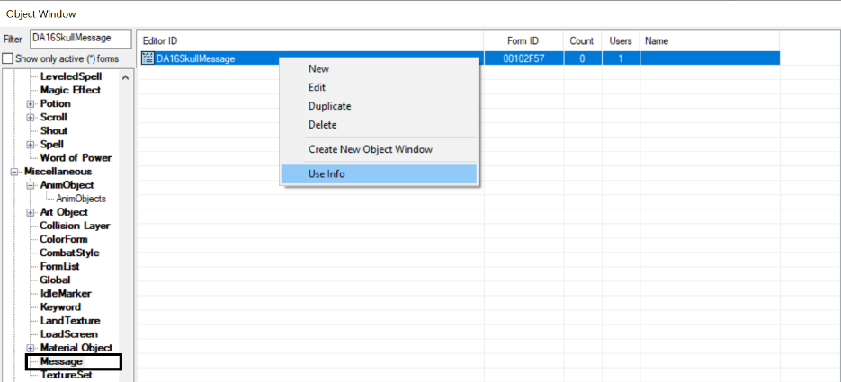

In the window that pops up, you see that there’s a Quest with the ID of
DA16SkullHandler that’s using that message. Great success! That’s what
we’re looking for. The quest has two scripts attached, one of which is
DA16SHQuestScript which if you open it up you’ll see has two methods to
adjust a counter whenever it’s casted, one for sleeping targets, one for
waking targets:

    function SleepSkullCount()
        pDA16Count.Value += 5
        UpdateCurrentInstanceGlobal(pDA16Count)
        pDA16SkullMessage.Show()
    EndFunction
    
    function WakeSkullCount()
        pDA16Count.Value -= 1
        UpdateCurrentInstanceGlobal(pDA16Count)
        pDA16SkullMessage.Show()
    EndFunction

First, copy this script into your mod to override it. Now, what we need
to remove the `.Show()` methods (that’s the notification) and replace it
with our own widget. So first, in order to access our widget inside this
script, same as before, add a Quest property and set it to your widget
quest. In your script change the type from Quest to SkullHud_Widget:

    SkullHud_Widget Property SkullHUD Auto

As mentioned at the start of the tutorial, SKSE gives us the ability to
access almost all menus in the game, we can send and receive data to
menus, or access their properties and methods. This is done by SKSE’s UI
methods. You can see a list of them under
[UI Script page in the
Wiki](https://ck.uesp.net/wiki/UI_Script). There are GetBool(),
GetString(), GetFloat(), GetInt() methods to get a property from an
instance in a menu, Set() methods to set those properties, and Invoke()
methods to call methods.

In all of these functions, you need a “menu name” as the first
parameter, this tells SKSE what menu you’re trying to access. The game
has a lot of menus, just take a look at the list on
[CK Wiki
page](https://ck.uesp.net/wiki/UI_Script#Valid_Menu_Names). So as
you see, anytime in game you see a UI element, it’s a “menu” and if you
know the name of it (that’s that list), you can access it via SKSE.

Back to our widget, to update it we need to send an Int value (of what
frame we want to show) to our widget. To do that we use the `InvokeInt`
function, so inside the SkullHud_Widget add an update method:

    Function Update(Int iDreams)
        Int iPercent = ( (iDreams / 50) * 100 ) as Int
        UI.InvokeInt(HUD_MENU, WidgetRoot + ".update", iPercent)
    EndFunction

What’s going on here? Magic! First, we calculate the percentage that the
staff is full. Note that in game, the skull doesn’t actually have an
upper limit on how many dreams it stores, I picked 50 just because it
seemed fitting, the staff costs soul gems too and around 50 fires you
lose the enchantment’s charge. But the big thing is the next line,
`InvokeInt`, it allows us to set an Int value inside an existing menu.
It requires three parameters: first is the menu name, second is the path
(ActionScript path) for the method we want to call (=\> invoke), and
third is the actual Int value we’re trying to send to Flash.

“`HUD_MENU`” and `WidgetRoot` are both properties that we get from
`SKI_WidgetBase`:

- 

  `HUD_MENU`’s value is just “HUD Menu”, this is the name of the game’s
  menu we’re trying to access.

  

- 

  `WidgetRoot` gives us the path we need to access our widget. Anything
  we put in our ActionScript (the class that we made earlier) we can
  access through this.

  

We don’t have a `.update()` function in our widget, but we’ll add that
next.

Compile this script, and in DA16SHQuestScript.psc we adjust the two
methods so after using the Skull, it calls the Update method. We send
Update() the value of the GlobalVariable `pDA16Count` which holds how
many dreams the Skull currently has.

    Scriptname DA16SHQuestScript extends Quest Conditional
    
    GlobalVariable Property pDA16Count Auto Conditional
    Message Property pDA16SkullMessage Auto Conditional
    SkullHud_Widget Property SkullHUD Auto
    
    function SleepSkullCount()
        pDA16Count.Value += 5
        UpdateCurrentInstanceGlobal(pDA16Count)
        SkullHUD.Update(pDA16Count.Value)
    EndFunction
    
    function WakeSkullCount()
        pDA16Count.Value -= 1
        UpdateCurrentInstanceGlobal(pDA16Count)
        SkullHUD.Update(pDA16Count.Value)
    EndFunction

Now for the ActionScript:

    import skyui.widgets.WidgetBase;
    
    class SkullOfCorruptionCounter extends skyui.widgets.WidgetBase {
        function update(a_frame:Number) {
            gotoAndStop(a_frame);
        }
    }

So whenever we call `Update()` method in Papyrus, it calls the
`update()` method we have in our ActionScript and jumps to a specific
frame, denoting how full the Skull is.

And that’s that. Publish your SWF file, compile all the scripts, and
check in game. Our widget shows whenever you equip the staff, and it
fills up or down whenever you cast.

Now you’re ready to make your own widgets! If you did enjoy this
tutorial and found it useful, please let me know, it might just make my
day better. :)
