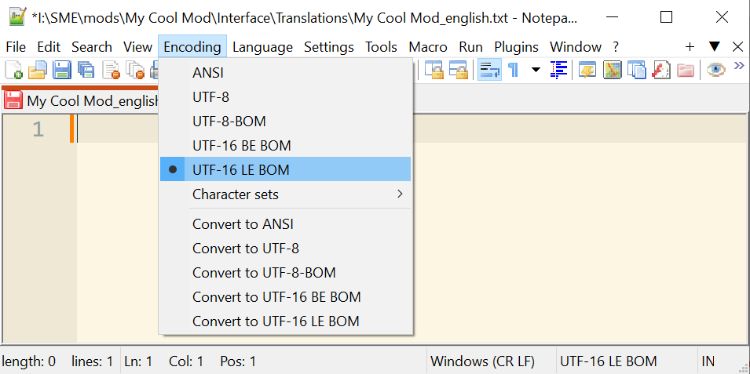
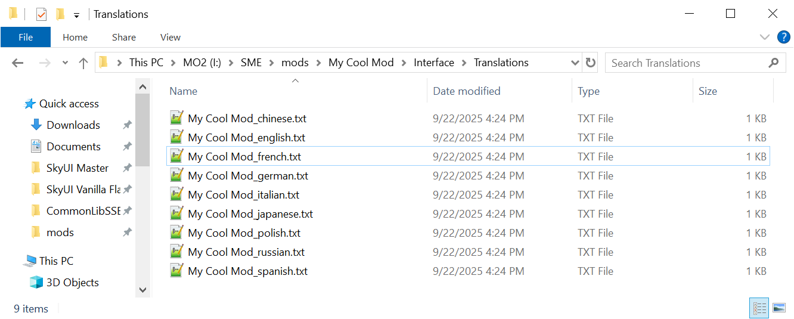

# Localizing MCM Menus {#localizing-mcm-menus .TOC-Heading}

# Contents {#contents .TOC-Heading}

[The Problem [1](#the-problem)](#the-problem)

[Translation Files [2](#translation-files)](#translation-files)

[Formatting the language file
[3](#formatting-the-language-file)](#formatting-the-language-file)

[Setting up other languages
[5](#setting-up-other-languages)](#setting-up-other-languages)

[MCM Helper [5](#mcm-helper)](#mcm-helper)

# The Problem

Not everyone plays Skyrim in English. The game has been officially
translated into 8 other languages (and more, unofficially). So as mod
authors, we must be cognizant of that and make our mods in such a way to
make the translation process as painless as possible. This document
covers how to properly setup the MCM configuration menu for localization
(I hope in the future I can expand this to cover quests and dialog too).

So, consider our SKI_ConfigBase script, in OnPageReset() we're adding
the options that display in the MCM page:

{width="6.5in" height="3.5597222222222222in"}

Since the text is inside the script itself, for translating the options
one must copy the script file, change the texts, and recompile the file.
Even ignoring the hassle of recompiling scripts (for one it's technical,
and second you may find there are layers of dependency that are
cumbersome to navigate), there is a huge issue that whenever there's an
update to this script, the translation has to be updated too. In the
best case scenario that means for people using the translated scripts
the options would mismatch what they expect from mod, worst case is this
causes script issues.

So tldr; this is pure awfulness. Lucky for us, we can use translation
files to separate out the texts inside the MCM scripts.

# Translation Files

Translation files are .txt file located in \"Interface\\Translations\\\"
directory inside your mod. First rule is, you need a plugin file (ESP,
ESM, or ESL), these files don't load if you don't have an ESP
accompanying them. The filename must be the same as your plugin file
(without the file extension), followed by the language code. So, say
your mod is named "My Cool Mod.esp", your translation file must be named
"My Cool Mod_english.txt":

{width="6.496527777777778in"
height="1.7430555555555556in"}

Take note of the path to our /Translations directory. Now, we have a
place to put our texts.

Second rule! Make sure the file encoding is set to **UFT16-LE BOM**,
otherwise our translation file gets ignored and doesn't load. I use
Notepad++ for everything and the file encoding can be set from Encoding
menu; other text editors have similar options:

{width="3.0101596675415574in"
height="1.5034722222222223in"}

# Formatting the language file

So, we have our language file. Next step, we must cut the texts out of
our scripts and put them here. Each individual text (read: string) must
be given a "key", and in the language file we make that specific key
equal to some text. **Keys are prefixed with a dollar sign**, followed
by a unique identifier. For example, from earlier screenshot, we have
the \"Main Quest Entrances\" text here for example:

\_MQEntranceSafe_M = AddMenuOption(\"Main Quest Entrances\",
\_MQEntranceOptionList\[rQuest.MQEntranceOption\])

We replace that with:

\_MQEntranceSafe_M = AddMenuOption(\"\$MAINENTRANCE\",
\_MQEntranceOptionList\[rQuest.MQEntranceOption\])

I like to use all uppercase for language keys, but that's just my
preference. Beware however, the **keys are case-sensitive**.

What happens when two mods use the same key for two different texts? To
avoid conflicts, make sure to always prefix the keys with something
unique, an abbreviation of your mod's name, or your username, or what
you prefer. Let's update that line:

\_MQEntranceSafe_M = AddMenuOption(\"\$COOL_MAINENTRANCE\",
\_MQEntranceOptionList\[rQuest.MQEntranceOption\])

Awesome. Now let's move to the language file. In it, you put each key on
a separate line (so one *key : text* pair on each line). Start with the
key, **followed by a tab** character, followed by your actual text:

\$COOL_MAINENTRANCE Main Quest Entrances

{width="3.037312992125984in"
height="1.1915616797900261in"}

Now rule number 3: make sure it's a Tab character separating the key and
text. Some editors use spaces instead of tabs and when you press Tab,
insert x number of space characters to represent a Tab. This is invalid
and that faulty line gets ignored. In Notepad++ this is configured under
Settings \> Preferences:

{width="4.667954943132108in"
height="2.1569346019247595in"}

Repeat this for all the texts the player sees. If everything's gone
well, you should see no difference in the MCM menu and it should work
and display just as it did before. That's success! Yay! What we've
accomplished now is, other people can now override those translation
files and translate / change the texts without touching our script
files. This also safeguards against updates since now our worst-case
scenario is the player with an un-updated language file will simply miss
some texts, no harm is done.

# Setting up other languages

Here's a new problem. When people use our mod in a non-English setup,
they won't be able to see any of it. This is because when a language
file is missing the game **does not** default to English. Even if you
don't intend to translate everything yourself, you have to supply the
translation files for all the available languages (you can just copy
paste your \_english.txt file so everyone will see the English texts).
Since the game is translated to 8 other languages, we must duplicate our
file for all of them:

{width="6.5in" height="2.6104166666666666in"}

And that's that.

# MCM Helper

[MCM Helper](https://www.nexusmods.com/skyrimspecialedition/mods/53000)
is an amazing tool. Not only it simplifies the process of making MCM
menus, but the [persistent storage
feature](https://github.com/Exit-9B/MCM-Helper/wiki/Setting-Types%2C-Storage%2C-and-Persistence#modsettings)
is an absolute godsend. MCM Helper uses a .JSON file for defining the
options. The process is not really different, instead of adding texts
into the .json file we use \$KEY keys and translation files. The only
thing of note is in the .json we have two properties, modName and
displayName. modName is the actual plugin file's name that the MCM
Helper will attach itself to, whereas the displayName is the text of
mod's name that is displayed in MCM. You must only translate the latter,
like so:

{width="6.5in" height="3.546527777777778in"}
