# Monitor Spells and Ring of Draconic Burde

# Intro

When we think of “Spells” in Skyrim we think of magic and the different
types of magic schools, but spells do far more and in this tutorial,
I’ll showcase a unique power of Spells and what they enable us to make.
We’re going to do that by making a ring that when player wears it, it
gives them extra carry weight based on how many dragon souls they have.
Why? Because in game, the extra dragon souls you’re carrying do
absolutely nothing for you so this would give them a purpose. I made
this ring a while ago for the
[LoreRim](https://lorerim.com)
modlist and you can download it from
[this
repository](https://github.com/shazdeh/LoreRim-Tweaks).

A basic familiarity with CreationKit and Papyrus is assumed. If you’re
not familiar with them I highly recommend you watch
[Skyrim
Scripting](https://www.youtube.com/@SkyrimScripting),
[Darkfox127](https://www.youtube.com/channel/UCtYB2iX9_52X_DNtSIJXyWg),
[Arcane
University](https://www.youtube.com/c/ArcaneUniversity/videos),
[Elianora](https://www.youtube.com/@Elianora),
or [Kinggath’s Bethesda Mod
School](https://www.youtube.com/playlist?list=PL2g2oK5KhZT0WUOw0Y_8HFudZbgfmcdEl);
to name a few of the plethora of channels available on YouTube. As a
sidenote, any tutorial you find for FO4 or Starfield’s CreationKit also
apply for Skyrim so there’s plenty to choose from!

Ready? Let’s get started!

# Creating the ring

Fire up the CreationKit and let’s get started! First step, we need to
add the ring itself. The easiest method would be to copy from an
existing ring, I chose JewelryRingGoldSapphire as the base for my ring
so duplicate that record (under Items \> Armor in the Object Window).
Give it name, ID and descriptive text. Also, since we want this to be a
unique item give it the `MagicDisallowEnchanting` keyword as well, this
will prevent this item from showing up in the Enchanting menu so they
can’t put a custom enchantment on it, or disenchant it.

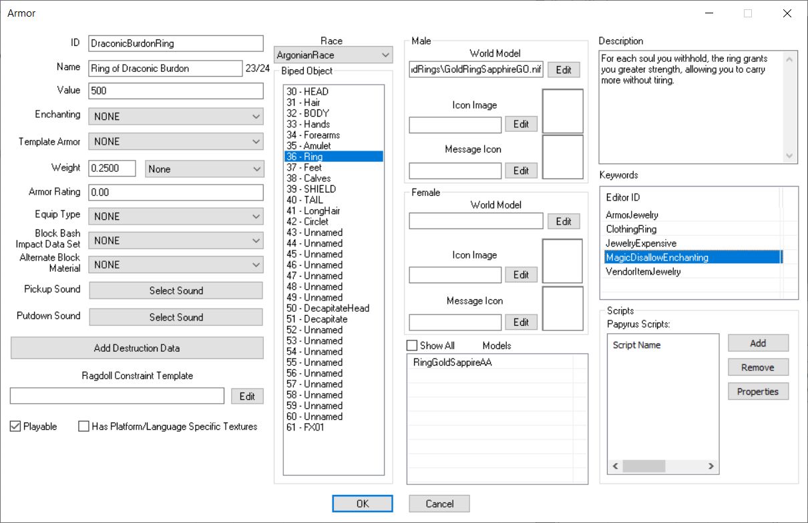

That brings us to the enchanting effect that we have to put on it. Our
effect needs to modify the [Actor
Value](https://ck.uesp.net/wiki/Actor_Value) of CarryWeight:

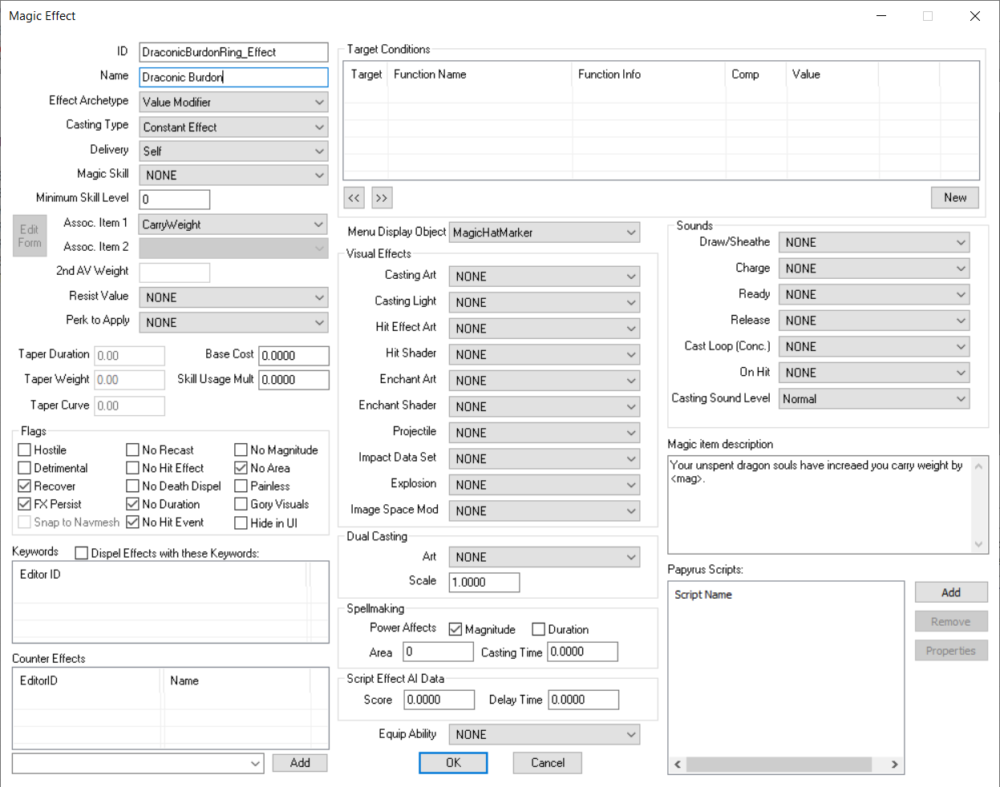

For armor Enchantments, the Casting Type has to be Constant Effect
(because you’re not actively casting, the effect is automatically
applied when you wear the armor) and Delivery must be Self. We need to
enable a couple of Flags too:

- Recover tag means when this effect can be removed: unequipping the
  armor removes the enchantment and so the value that we modified has to
  reset back to what it was before this effect was applied.

- No Duration tag is needed too since we don’t have a time limit on our
  MagicEffect: it lasts as long as the enchantment is in applied.

- No Area flag means this MagicEffect is only for the actor wearing the
  ring, it doesn’t affect other actors nearby.

Now let’s create the Enchantment. The Casting and Delivery options on
our enchantment must match the MagicEffect we created earlier. In the
Effects list right click and hit New and add our effect:

The Magnitude is how much we want the CarryWeight Actor Value to be
modified when this effect is applied. The number we set for the
Magnitude doesn’t matter at all, because this gets changed later on, we
don’t want this to a flat number. However, I put 0 there to make testing
it easier: if we equip and it gives 0 carryweight then we can be sure
something’s off.

So how can we make it so this value is dynamically set based on the
number of dragon souls? For that we’re going to use a Perk. Perks can
affect the magnitude of enchantments and the number of dragon souls the
player has is stored as an ActorValue called “DragonSouls”; this is very
fortunate for us since through Perks we can adjust the Enchantment’s
magnitudes based on any ActorValue.

Before we go further make sure to edit your ring and set the Enchantment
option to the enchantment we created.

Let’s add the perk, from the Object Window select Actors \> Perks and
add a new one, then add a new Perk Entry (this is where we set what
types of changes this perk makes). For our enchantment we need to modify
the “magnitude” of the effect, meaning “how much” the ActorValue of
CarryWeight gets modified by the MagicEffect, so select Mod Spell
Magnitude as the Entry Point. For the Function set it to “Set to Actor
Value Mult”, that meaning the end result of this perk is the value gets
multiplied by an ActorValue and multiplied again by a fixed number, so
in the dropdown select Dragon Souls and the fixed number to 10:

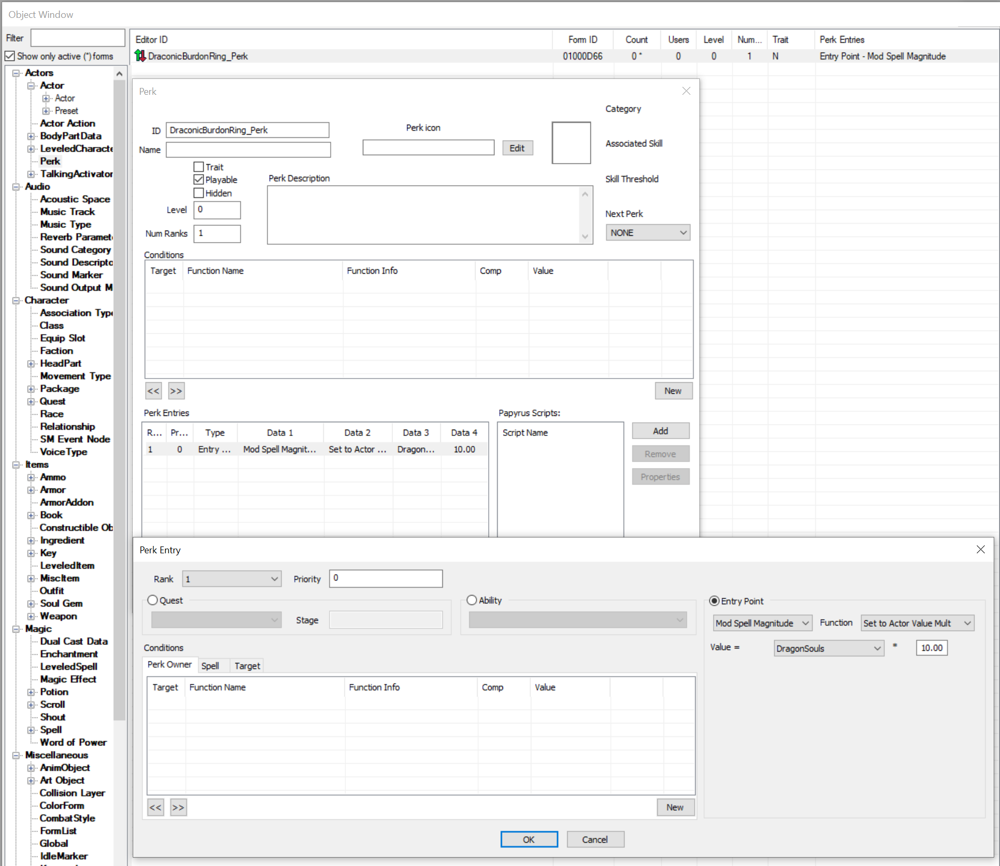

Think about what’s happening here: when player has no dragon souls, the
perk sets the value to: 0 (=\> no dragon souls) \* 10 which is 0, so the
enchantment has no effect when you don’t have a soul. When you do, that
value becomes: “how many dragon souls you have” \* 10. Perfecto!

Last step, we need to limit this perk and what it’s applied on. The Mod
Spell Magnitude applies to **any** type of magical effect, be it a
Potion you drink, shouts, divine blessings, actual spells you cast, etc.
We don’t want “everything” to be affected by this perk so under
Condition \> Spells add a condition to limit its scope:

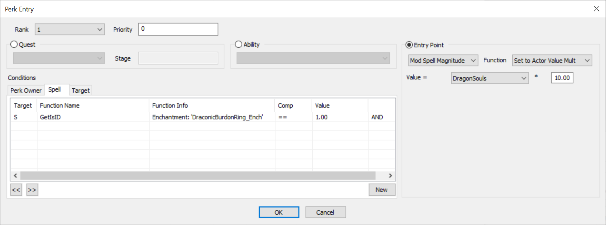

Don’t be fooled by the fact that it says “Spell” under the Condition
tab, “Spells” are a way broader concept, so worn enchants, consumed
potions, foods or ingredients, shouts, or whenever you use an scroll or
staff, all pass through this entry point.

Let’s test this in game. Save CK, make sure your mod is active, then
launch the game. Bring up the Console (the `~` key) and type:

    player.addperk DraconicBurdonRing_Perk

This gives us the perk, next add the ring itself:

    player.additem DraconicBurdonRing 1

Now go to your inventory and view the ring, if you’ve done everything
correctly you should see in the description that says “… increased your
carry weight by 0.” Why zero? Because we have no dragon souls! Let’s add
a soul:

    player.modav dragonsouls 1

Now check your inventory again, the ring’s description says, “…
increased your carry weight by 10.” Marvelous!

> **The console commands are not working for me!**
> 
> If you get an error when using the above commands, that means you don’t
> have the [powerofthree's
> Tweaks](https://www.nexusmods.com/skyrimspecialedition/mods/51073)
> mod installed, and I don’t know what you’re doing with your life. Go
> install it, and endorse it as well.

# Adding the Perk

Before we go further, let’s implement adding our perk to the player. You
may have noticed in MagicEffects we have an option for “Perk to Apply”
which gives the perk to the effect’s target. This option **only** works
for the player, you cannot give perks to other actors in the runtime.
However, we are making this for the player so it should work for our
purpose. Edit the MagicEffect form to set the Perk to Apply option:

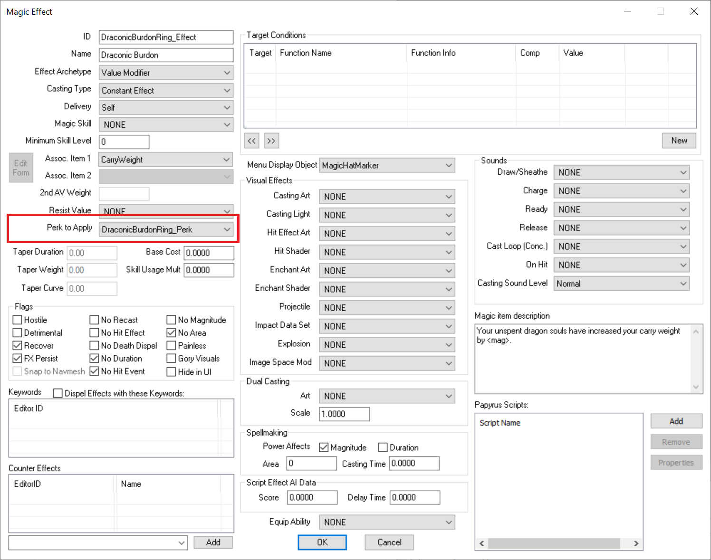

Now launch the game and test: give yourself the ring again, and use
“modav” console command to also give yourself a couple of dragon souls.
Equip the ring, and… it doesn’t work. No extra carryweight is gained.
This tells us something: the Perk to Apply adds the perk *after* the
MagicEffect goes through the perks list to see which one affects this
effect. Meaning, it doesn’t change the magnitude for the very Effect
that is adding the perk, so it’s not useful for us.

Let’s try another idea. What if our Enchantment adds two MagicEffects,
first one adds the perk, then the second one modifies the carryweight
AV? Add a new MagicEffect form:

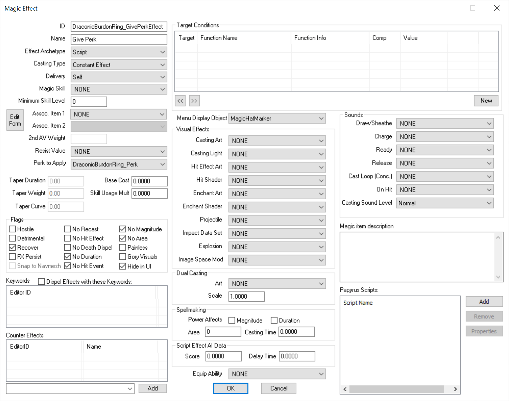

This ME doesn’t need to show in UI, it’s just to add the perk so the
**Hide In UI** flag is set. Next, edit the Enchantment form so it adds
both effects:

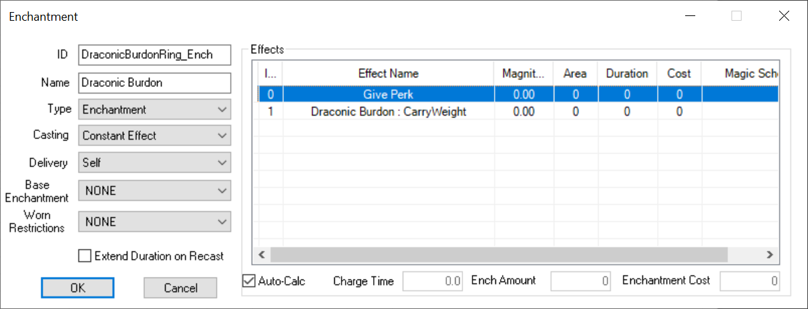

So our Enchantment is now first adding the Give Perk effect, then the ME
to modify the AV. Run the game, test again. And the result is… this
doesn’t work either. Again, this tells us something: when you have
multiple MEs they apply all at once, *then* the Perk to Apply options
are applied. This is useful to know!

There are
[OnEquipped](https://ck.uesp.net/wiki/OnEquipped_-_ObjectReference)
and
[OnUnequipped](https://ck.uesp.net/wiki/OnUnequipped_-_ObjectReference)
events in Papyrus, but they’re not useful to us because Papyrus code is
slow, and it runs way after the enchantment is applied. So instead, we
can give the perk when the item picked up by the player, and remove the
perk when the item is removed. This is not ideal because that means the
game has to check for our perk needlessly even when the item is not
equipped, but we’ll revise this later. Edit the ring’s Armor form and
add this script:

    Scriptname DraconicBurdonRing_Script extends ObjectReference

    Perk Property DraconicBurdonRing_Perk Auto

    Event OnContainerChanged(ObjectReference akNewContainer, ObjectReference akOldContainer)
        If akNewContainer == Game.GetPlayer()
            Game.GetPlayer().AddPerk(DraconicBurdonRing_Perk)
        ElseIf akOldContainer == Game.GetPlayer()
            Game.GetPlayer().RemovePerk(DraconicBurdonRing_Perk)
        EndIf
    EndEvent

In the script we check if the item was moved into player’s inventory
(`akNewContainer == Game.GetPlayer()`) and if so, use the `AddPerk()`
function to give the player the perk, otherwise if the item is being
dropped by the player (player is the old container:
`akOldContainer == Game.GetPlayer()`) then remove the perk. Don’t forget
to edit the Properties as well to “fill” in the values. Since we named
our Property in the script exactly as it’s named in the game, we can
just hit Auto Fill button and CK will automatically connect that
Property to our perk.

| Similar to Perk to Apply option in ME forms, the AddPerk() function also only works for the player. You cannot use this to dynamically give other actors perks in gameplay time. |
|----|

# Problem: changes to dragonsouls count

Equip the ring, and it should give you the 10 extra carryweight. Now,
give yourself another dragon soul by running this command again:

    player.modav dragonsouls 1

Go to your inventory, you should see the description reflects the fact
that we now have 2 souls and thus should have 20 extra weight, but our
actual carry weight hasn’t updated. Why?

The reason is perks only apply when the effect is being applied. The
game doesn’t say: “*this perk has an entry point for ‘dragonsouls’
ActorValue so I need to update the effect*”, it applied once and
stopped. So, when is the perk applied? Our effect is put on an
enchantment, that means it applies whenever we equip the item. Test
this: unequip the ring, then re-equip it back. Now you should see the
correct result.

That’s nice, but we can’t expect the player to equip and unequip our
ring to make it work. We need to find a way to do that automatically
whenever the number of unspent dragon souls changes (ie: when you
acquire one, or spend one). Problem is though, there’s no event in
Papyrus for that. [PO3’s Papyrus
Extender](https://www.nexusmods.com/skyrimspecialedition/mods/22854)
gives us the ability to have a callback when player absorbs a dragon
soul, but that still won’t be enough for us because we need to know when
the player spends that soul as well.

If you’d like to review everything we’ve built so far, check the files under [Files/Ring of Draconic Burdon Part 2]() directory.

# Spell Conditions

You may have noticed when we add Magic Effects there’s a Condition box,
we can control when that effect is applied, but we also have Conditions
for Spells:

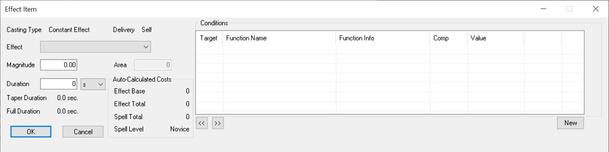

Why two separate Condition checks? The reason is they’re applied
differently. Conditions you put on a MagicEffect form are only applied
once (when the magic effect hits the actor), whereas Conditions you put
on a spell run continuously, **once per second** to be exact. That means
if we put a condition on a spell, and add some scripts to the
MagicEffect that is attached to that spell, when that condition becomes
“true” the effect gets applied, and our code runs. We can get a
“callback”, (=\> run custom code) whenever that condition is true. Let’s
start simple, let’s say we need to run code whenever player swims.

First, add a MagicEffect:

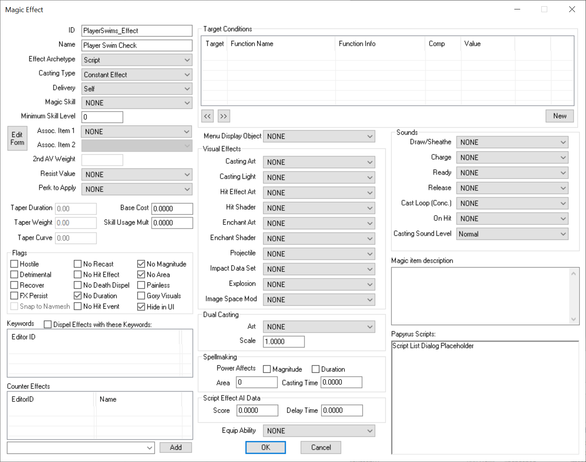

The Archetype is set to Script because we don’t need this MagicEffect to
change anything on the player, just to run script. Casting Type is set
to Constant because whenever this effect is applied, it’s “on”, it needs
to persist as long as it needs to, rather a Fire & Forget type which
“fires” then vanishes. We don’t need any magnitude or duration or area
since it’s all scripts, so all those flags are set. Hide In UI is also
active because we don’t want the player to see this in their Active
Effects list, it’s applied but it doesn’t show up in the UI. Next, add
the Spell:

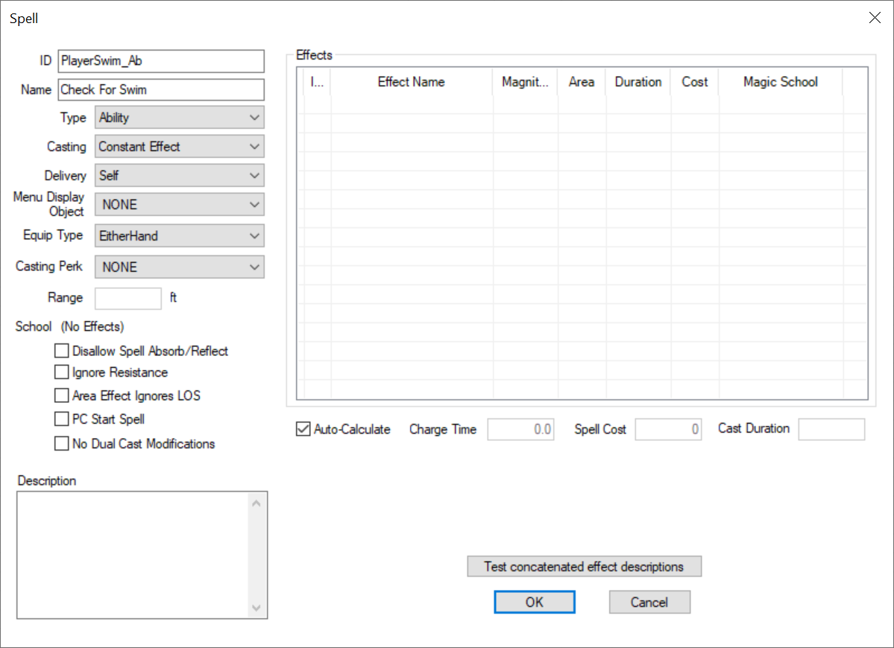

The only crucial part here is we set the Type to Ability. This isn’t a
spell you “cast”, like Conjure X or Firebolt, it’s a MagicEffect that is
applied to player, and with Ability-type we don’t need to “cast” that
spell to make it do stuff. Now add the magiceffect we created earlier:

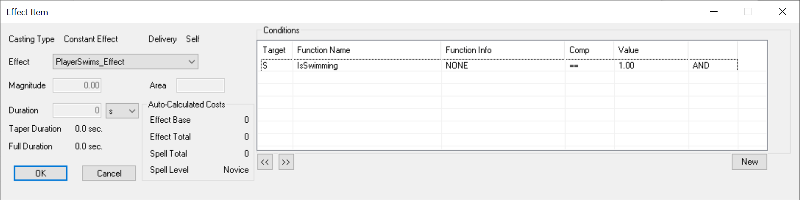

In Condition we have added, “IsSwimming == 1” meaning whenever the
player swims (we add this to Ability spell to the player, so that means
the condition gets applied to the player, more on that later) the
magiceffect gets applied, and whenever they stop swimming (thus
IsSwimming becomes `false` or `0`) the MagicEffect gets removed as well.
Remember, since we’re putting this condition on the Spell, this runs
continuously: once per second.

Now edit the MagicEffect to add an script:

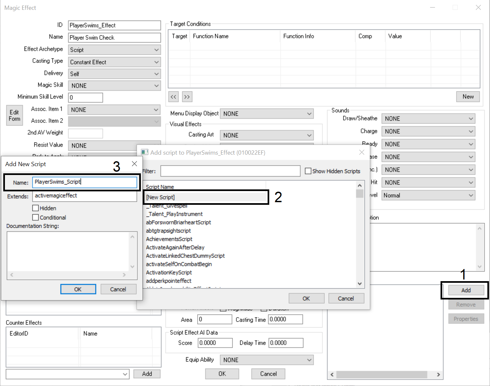

And for our script:

    Scriptname PlayerSwims_Script extends activemagiceffect

    Event OnEffectStart(Actor akTarget, Actor akCaster)
        Debug.notification("Player is swimming")
    EndEvent

    Event OnEffectFinish(Actor akTarget, Actor akCaster)
        Debug.notification("Player stopped swimming")
    EndEvent

Let’s review what’s happening, whenever the Spell condition applies the
MagicEffect gets applied, this runs the script on the ME, and calls the
`OnEffectStart()` event so we know the player is swimming at this
moment. And this persists (remember we set the Casting Type to Constant
Effect and with No Duration flag) until the player stops swimming, at
which point the condition no longer is true and the effect gets removed,
and as it’s removed it calls the `OnEffectFinish()` event.

Time to test this in game. Use the console command:

    player.addspell PlayerSwim_Ab

You can review the code in Files/Player Swims Monitor. Now you should
see notification pops up whenever you go in water, and out. Magnificent!
This is unlimited power at our disposal, as there’s a plethora of
Condition Functions (see:
[https://ck.uesp.net/wiki/Condition_Functions](https://ck.uesp.net/wiki/Condition_Functions))
that we now have access to and we can get callbacks for. However,
there’s nothing for dragon souls absorbed or spent, so how does this
help us?

# Custom Callback for DragonSouls ActorValue

“How many dragon souls player has” is an ActorValue, so we can use the
[GetActorValue](https://ck.uesp.net/wiki/GetActorValue)
conditional function to get its value and compare it to something else.

> **GetActorValue is not the only conditional function we can use for AVs:**
> 
> - **GetBaseActorValue** this does
> the same as GetActorValue however buffs are not counted, for example if
> you drink a Fortify Health potion, GetBaseActorValue returns the value
> without counting that potion.
> 
> - **GetActorValuePercent**: returns
> the AV as a percentage value, however beware that instead of a value
> between 0-100, it gives you a float value between 0 and 1.

So how can we detect when this AV changes? Easy! We store it in a
variable so later we can run a condition: “is this AV equal to that
stored value?” If it’s not then there has been a change. This is where
we need to add a GlobalVariable because in form Conditions we can
compare directly to a GlobalVariable’s value:

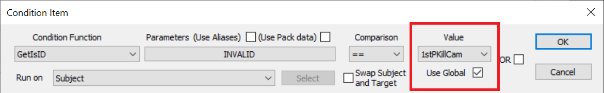

We need to add our GlobalVariable first:

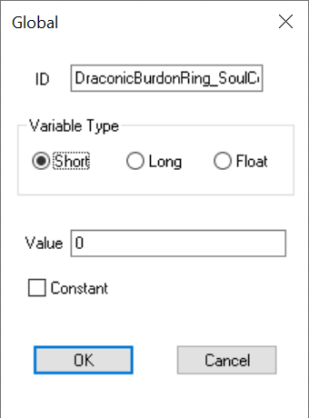

Now add the ME:

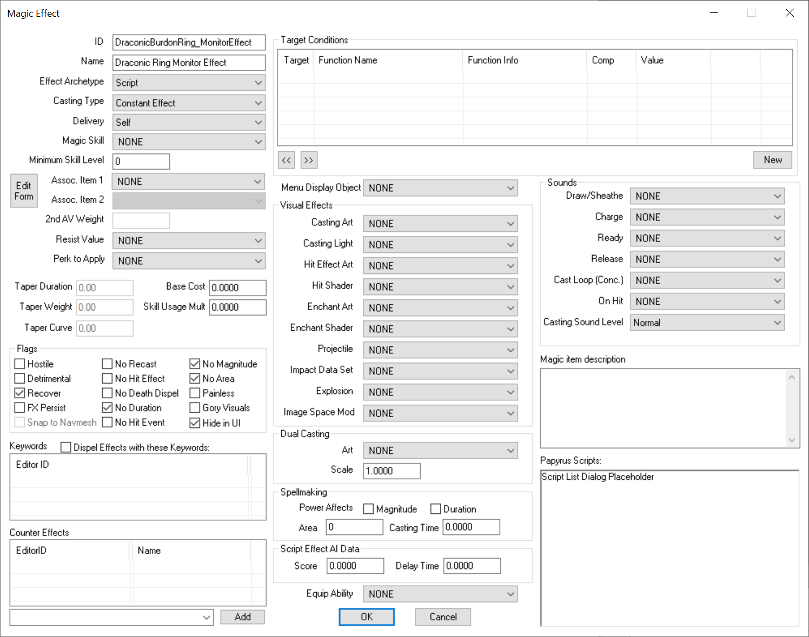

I tend to use “monitor” in the ID of these types of effects, because
they’re “monitoring” various conditions in game. Now add the Spell and
add the ME to it:

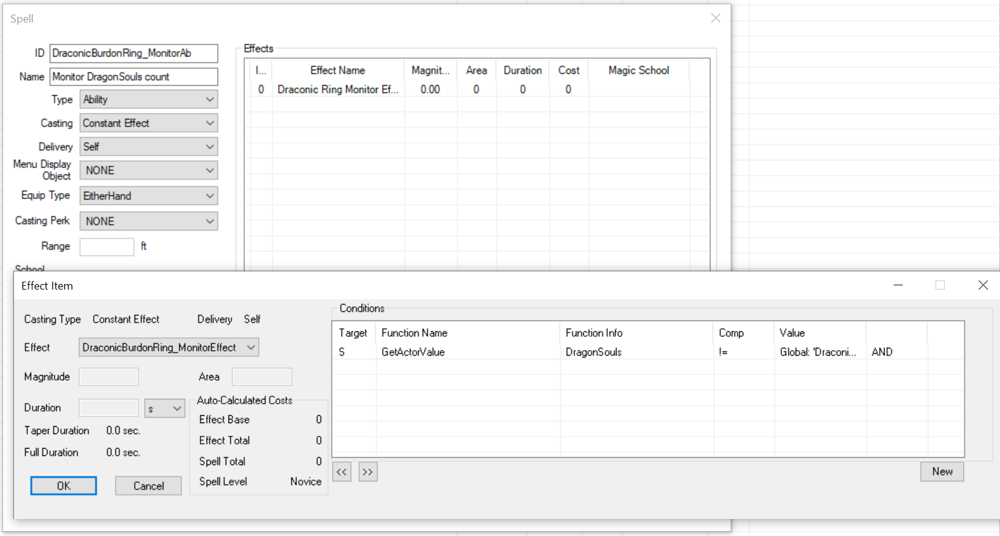

Notice that the Type of the spell is set to Ability, because this is not
a spell for the player to *cast*, its intent is to apply the ME. Now for
the condition inside the Spell, set it to: GetActorValue:DragonSouls !=
Global:DraconicBurdonRing_SoulCount

So, whenever the AV of `dragonsouls` on the player mismatches with what
we have stored on the GlobalVariable of DraconicBurdonRing_SoulCount,
the ME should apply. Next, we add a script to our Monitor effect so it
equips and unequips the ring whenever the effect is applied:

    Scriptname DraconicBurdonRing_MonitorScript extends activemagiceffect

    GlobalVariable Property DraconicBurdonRing_SoulCount Auto
    Armor Property DraconicBurdonRing Auto

    Event OnEffectStart(Actor akTarget, Actor akCaster)
        akTarget.UnEquipItem(DraconicBurdonRing, abSilent = True)
        akTarget.EquipItem(DraconicBurdonRing, abSilent = True)
        DraconicBurdonRing_SoulCount.SetValue(akTarget.GetActorValue("DragonSouls"))
    EndEvent

What’s happening here? Whenever the player obtains or loses a dragon
soul, the “dragonsouls” AV gets updated, that means our GlobalVariable
doesn’t match that AV and the DraconicBurdonRing_MonitorAb Spell applies
our ME, we use the `OnEffectStart()` event to equip and unequip the
ring, then set the value of our GlobalVariable to the AV again: this
makes the effect stop applying thus preparing it for the next time those
two values don’t match.

Don’t forget to connect those two Properties to their Forms.

Lastly, we need to add the Monitor spell to the player as well. We don’t
need any code for that, Perks can add Spells as well, so in our
DraconicBurdonRing_Perk perk we can add a new Entry and add our Ability
spells:

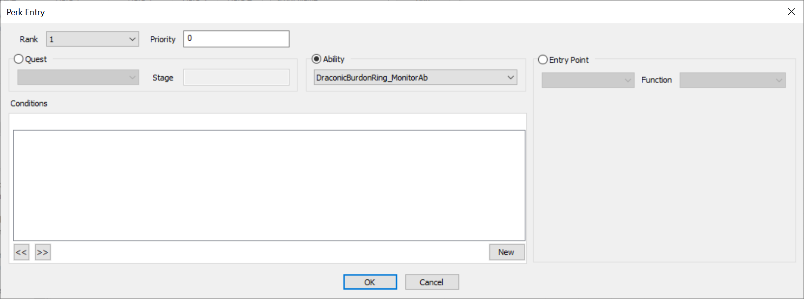

Time to test! Launch the game, add the ring via console and equip it. It
should give you 0 extra carry weight. Now add a dragonsoul to yourself.
You should hear the sound of equipping an item, that means our script
has properly executed and has unequipped, then equipped the ring. Check
your carryweight. Now add another dragon soul. The carryweight gets
updated automatically. Wow!

But this is awful though, right? That you can hear the item being
unequipped and equipped. Interestingly, the `EquipItem()` and
`UnEquipItem()` have a `abSilent` parameter you can set which suppresses
the UI notification messages, but doesn’t suppress the sound. Also our
perk is always in effect while player is carrying the item (even when
not equipped), which isn’t a performance impact by any means, but it’s
not good enough nonetheless!

If you’d like to review everything we’ve built so far, check the files under [Files/Ring of Draconic Burdon Part 1]() directory.

# Scripted Spell Casting

Skryim gives us the ability to cast Spells via Papyrus, this is not to
be confused when actors (like enemy mages) cast spells like Firebolt,
there’s no animation attached to this, what we mean is to fire off the
spell “as if” the Actor has casted it (more precisely, the
*ObjectReference*, as you could have a rock for example that does the
casting). The method we use to do this depends on the Spell type:

- For Ability-type Spells we use the
  [Actor.AddSpell()](https://ck.uesp.net/wiki/AddSpell_-_Actor)
  to apply that Ability to the actor, and
  [Actor.RemoveSpell()](https://ck.uesp.net/wiki/RemoveSpell_-_Actor)
  to remove it.

- For spells that are casted by actors we use the
  [Spell.Cast()](https://ck.uesp.net/wiki/Cast_-_Spell)
  method which has two parameters, “akSource” to define what
  ObjectReference is doing the casting, and an optional akTarget
  parameter in case of targeted spells so we can shoot our spell towards
  that target.

So here’s the basic premise: instead of our enchanted item applying the
DraconicBurdonRing_Effect effect (which adds CarryWeight) we apply that
as a separate Spell on the player, so whenever we want (in this case
when the number of DragonSouls AV changes) we can remove that spell and
apply it again. This way our ring will always have the correct effect on
the player, without needing to unequip and re-equipping it to update the
values.

First off, we don’t need the script attached to the ring, so edit the
ring and remove the DraconicBurdonRing_Script.psc script.

Next create the Spell that we want to toggle on/off on the player:

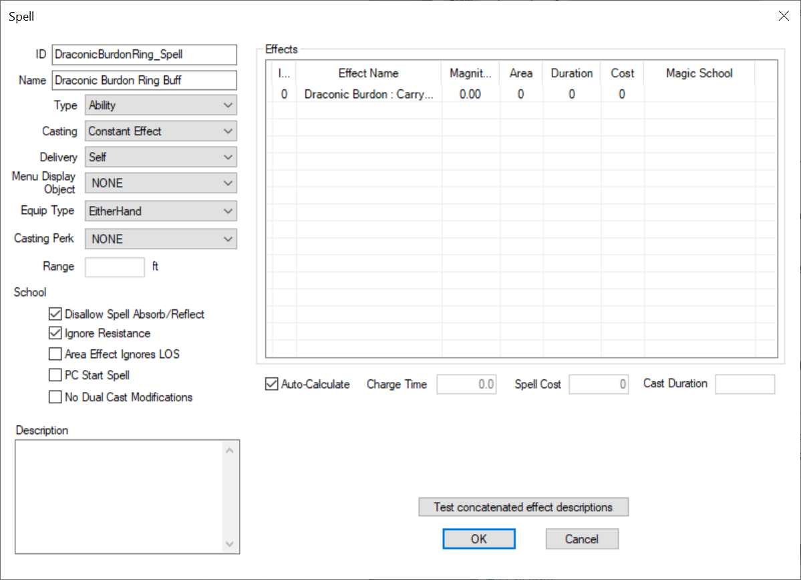

Make a duplicate of DraconicBurdonRing_Effect MagicEffect and name it:
DraconicBurdonRing_EnchEffect, this is the effect that goes on the
enchantment:

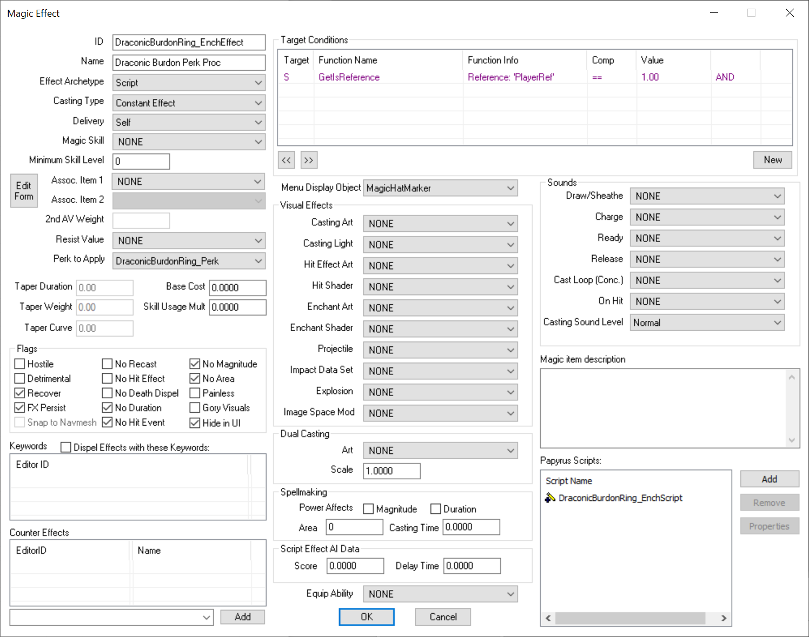

Change the Effect Archetype to Script, use the Perk To Apply option to
give our perk to the player, and add DraconicBurdonRing_EnchScript.psc
script to it:

    Scriptname DraconicBurdonRing_EnchScript extends activemagiceffect

    Spell Property DraconicBurdonRing_Spell Auto

    Event OnEffectStart(Actor akTarget, Actor akCaster)
        akTarget.AddSpell(DraconicBurdonRing_Spell, abVerbose = False)
    EndEvent

    Event OnEffectFinish(Actor akTarget, Actor akCaster)
        akTarget.RemoveSpell(DraconicBurdonRing_Spell)
    EndEvent

When player equips the ring and enchantment applies, first the perk is
applied, then `OnEffectStart` gets called and adds the
`DraconicBurdonRing_Spell`. We also need to remove the spell when the
Effect wears off (player unequips the ring).

We also need to update our DraconicBurdonRing_MonitorScript.psc script
so that instead of equip/unequip, removes the spell and re-adds it:

    Scriptname DraconicBurdonRing_MonitorScript extends activemagiceffect

    GlobalVariable Property DraconicBurdon_SoulTrack Auto
    Spell Property DraconicBurdonRing_Spell Auto

    Event OnEffectStart(Actor akTarget, Actor akCaster)
        akTarget.RemoveSpell(DraconicBurdonRing_Spell)
        akTarget.AddSpell(DraconicBurdonRing_Spell, abVerbose = False)
        DraconicBurdon_SoulTrack.SetValueInt(akTarget.GetAv("DragonSouls") as Int)
    EndEvent

Lastly edit the Enchantment so it adds our new Effect, plus the Monitor
Effect:

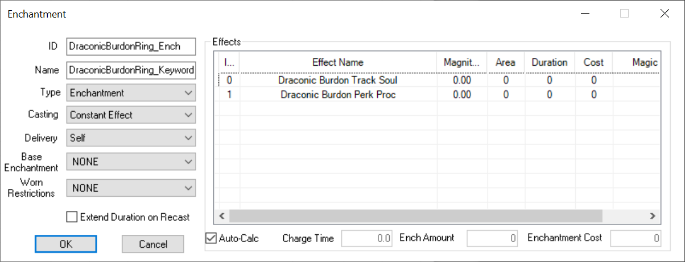

That’s it. The ring now quietly updates itself whenever our dragon souls
count changes.

The full mod can be reviewed in [this
repo](https://github.com/shazdeh/LoreRim-Tweaks).
