# Contents

[Method 1: Adding item to a shop
[1](#method-1-adding-item-to-a-shop)](#method-1-adding-item-to-a-shop)

[Prevent player from stealing it
[4](#prevent-player-from-stealing-it)](#prevent-player-from-stealing-it)

[Method 2: Using LeveledItems
[4](#method-2-using-leveleditems)](#method-2-using-leveleditems)

[Method 3: Using a Quest to spawn the
item
[9](#method-3-using-a-quest-to-spawn-the-item)](#method-3-using-a-quest-to-spawn-the-item)

[Help! Item doesn’t appear in
shop!
[13](#help-item-doesnt-appear-in-shop)](#help-item-doesnt-appear-in-shop)

[Perk to reduce the price of unique
items
[16](#perk-to-reduce-the-price-of-unique-items)](#perk-to-reduce-the-price-of-unique-items)

# Goal

In this tutorial, we'll add unique items to a shop. These items will be
available for purchase only once, and won't appear anywhere else or be
integrated into leveled lists, making purchasing them the sole way to
obtain them. This is inspired by Fallout 4 where pretty much every
vendor you come across has a unique thing, making the shops much more
interesting.

This tutorial assumes you know the basics of CreationKit. If not, you
can start by following [Bethesda’s
introduction to CK](https://www.youtube.com/watch?v=gDKivlGmia4)
series and this tutorial on [how to add
items](https://ck.uesp.net/wiki/Bethesda_Tutorial_Creating_an_Item).

# Method 1: Adding item to a shop

To start, fire up the CK, and add your items. Next, we need to decide
who we’re giving this item to sell. I’ve been spending a lot of time in
The Drunken Huntsman recently so I’m going to give Elrindir the tavern
owner a unique bow to sell.

First step, we need to find what the “vendor faction” of our vendor is.
Every shop in the game is associated with a unique Faction. To find
this, find your target NPC under the Actors list then check the Factions
tab:

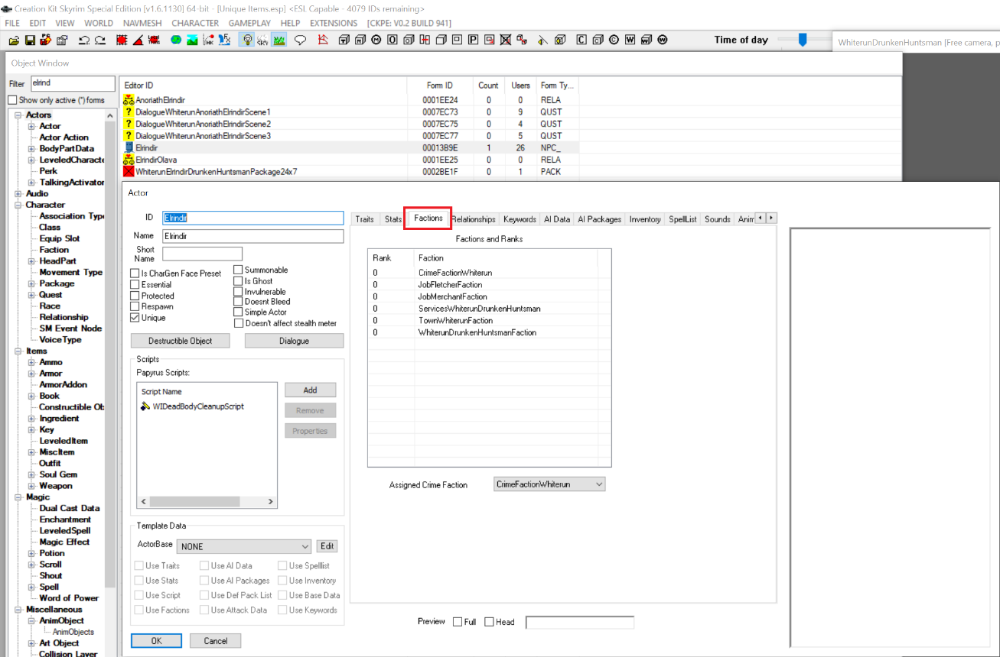

Now go through the list one by one, double click on it to open the
Faction record, then switch to the Vendor tab to see if it’s active. In
the case of Elrindir, the Faction that has Vendor active is:
“ServicesWhiterunDrunkenHuntsman”:

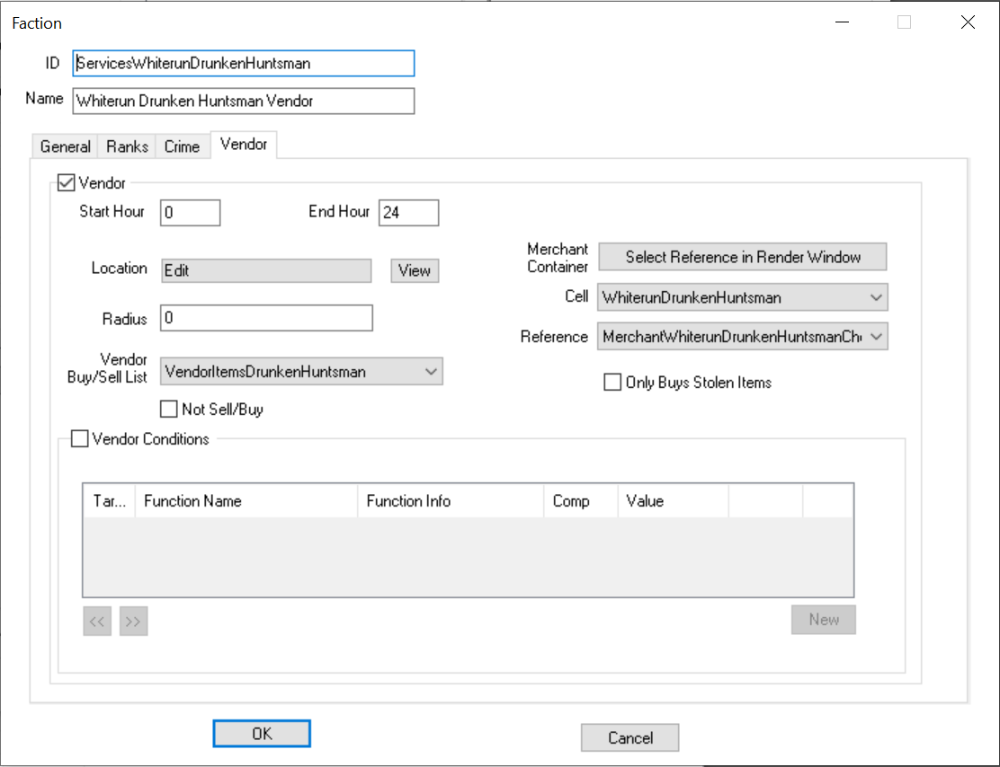

Write this down as we’ll need it.

Next load up the cell where your vendor operates. From the Object Window
drag your item and drop it in the world, to create a “reference” to that
item. You can put this somewhere where the player can see and interact
with it (maybe you want the player to be able to steal said unique
item), or you can put it in the void (the grey area) where they won’t
have access to it. From what I’ve tested, as long as it’s in the same
cell as your vendor it works fine.

Double click on the reference to edit it. Switch to the Ownership tab
and in the Factions dropdown, select the vendor faction we found
earlier:

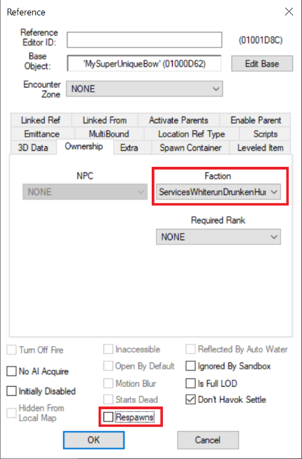

Also disable the Respawns checkbox so that after the cell resets, the
item does not come back.

**Merchant’s faction is not showing in the list!**

If the merchant faction is not showing up here in that list, don’t
panic! All you need to do is to edit the Faction form, and in the
General tab make sure Can Be Owner option is ticked:

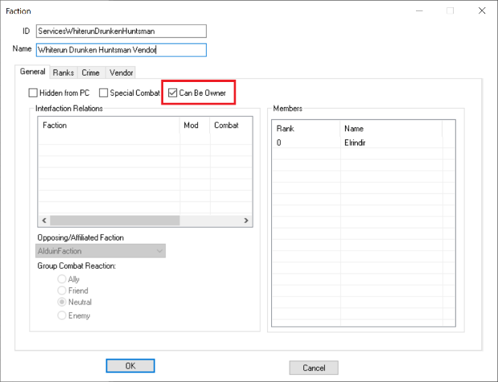

If you’re putting your item out in the void, you might want to tick the
“Don’t Havok Settle” option as well, this prevents the object from
falling out of bounds where our merchant can’t reach it. Although,
ticking this option might not be enough: if something bumps into it, it
activates Havok (=\> physics) on the object which can cause issues. So
to prevent that, switch to the Script tab, and add
“`defaultDisableHavokOnLoad`” script to it as well. This ensures the
item doesn’t move at all, regardless of what happens.

And that’s it, now the vendor sells the item! Go in game and check it
out.

## Prevent player from stealing it

You may want to have your unique item be displayed in the shop so
players can see and admire it, but not give them the ability to steal
it. That is easily achievable. Edit your reference and switch to the
Script tab, now add “`defaultBlockActivation`” script to it, and just
hit OK:

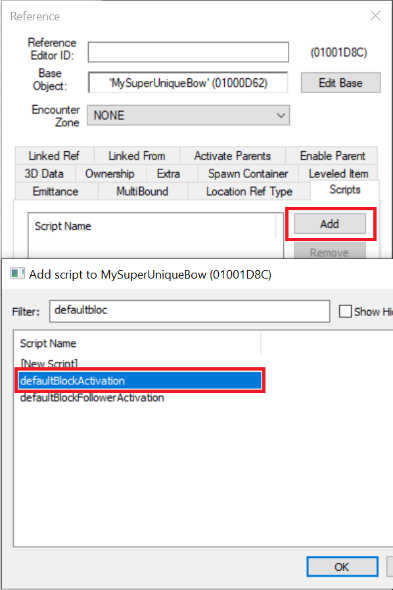

In game, the player now sees the item, but cannot pick it up.

# Method 2: Using LeveledItems

Now let’s add a new item to a shop, but using a different method. This
time, we’ll use LeveledItems. This method might be less desirable
because it involves editing some game records and thus require patching
later on. For the purpose of this tutorial, I’m going to give Belethor a
unique boot item to sell.

So first, same as before, find the Faction where the merchant is
assigned a Vendor role, this time we’re taking a note of the Merchant
Container option:

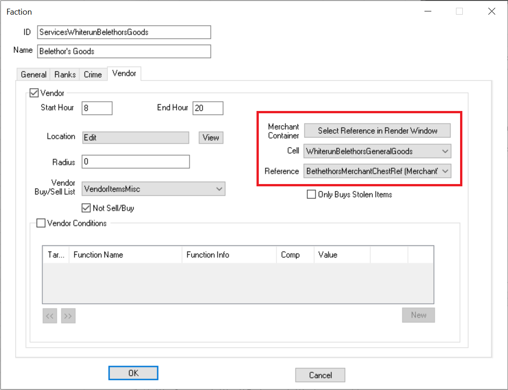

Every merchant has a unique “container”, this is where they pull their
items from when you’re bartering with them. So in the Cell View panel,
find the cell where it’s located and on the list on the right find the
container, right click and choose Edit:

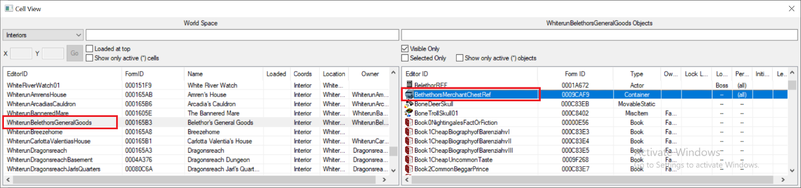

In the window that opens click Edit Base. This points us to the
Container where our merchant is pulling from, anything you put here,
that merchant is going to sell:

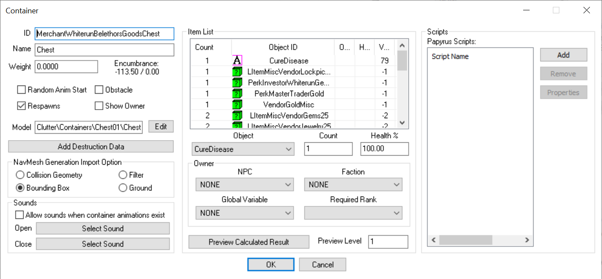

However, we don’t want to add our unique item here. Because that would
make it so that after you buy the item and come back later after their
inventory has been reset (ie, some in-game time passes) the item will be
there again and we don’t want that. Instead, we’ll make a “leveled item”
that makes our item spawn based on conditions we set. So in Object
Window, go to Items \> LeveledItem and add a new form here, give it a
unique name, then in the empty area right click and select New, then
select your unique item on the right dropdown:

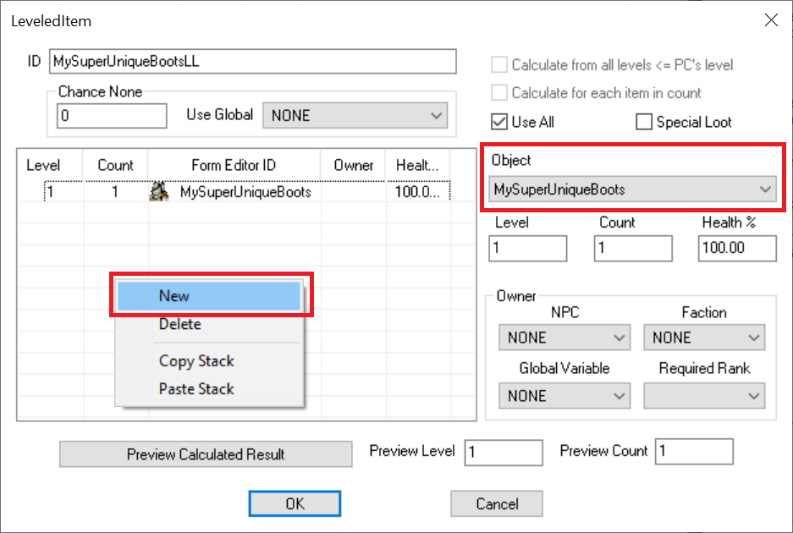

If you notice among the options we have a “Chance None” option. This
controls the percentage chance (0 to 100) that when the game is
attempting to pull the item from this list, it won’t return anything (so
the list will return None instead of the item it has). This is what
we’re going to use, at the beginning the Chance None should be 0, that
means there’s a 0% chance that this leveled-list will return None (so
it’s guaranteed that it will return our unique item), but after the
player purchases the item we change the Chance None to 100, meaning
there’s 100% chance that it will return None and thus our unique item
won’t spawn.

First, don’t forget to add this LeveledItem to the merchant container we
found earlier. Scroll to the bottom of the list and right click on the
empty area, select New, this adds a ne entry to the top of the list,
simply open the Object dropdown and select that LeveledItem we made
earlier:

Now, edit the item itself as we’re going to need an script to it, such
that whenever player buys it we manipulate that Chance None option of
our LeveledItem:

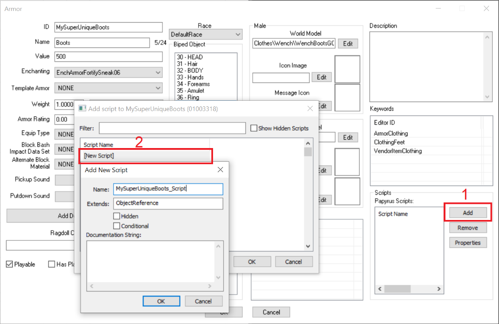

After you click OK, right click on the script that was just added and
select Edit Source, then add:

    Scriptname MySuperUniqueBoots_Script extends ObjectReference

    LeveledItem Property MyLeveledItem Auto

    Event OnContainerChanged(ObjectReference akNewContainer, ObjectReference akOldContainer)

    If akNewContainer == Game.GetPlayer()

    MyLeveledItem.SetChanceNone(100)

    EndIf

    EndEvent

How can we run a code when player purchases the item? Every actor (=\>
NPCs, and the player itself) are a “container”, the player has a list of
items they have on them, so does every other NPC. When you buy
something, the item is taken from the merchant container, and is placed
inside your container, so the item is just changing from one container
to another. So we listen to the “OnContainerChanged” event, this gets
called anytime the object swaps containers. We just need to verify that
the new container the item is going to is the player itself. After that,
we use the SetChanceNone method to adjust the Chance None option for a
LeveledItem. That’s out next step, we need to let the game know “what”
leveneditem needs to be manipulated.

Save the script, then right click on it and select Edit Properties, then
set the MyLeveledItem to the LeveledItem we created earlier:

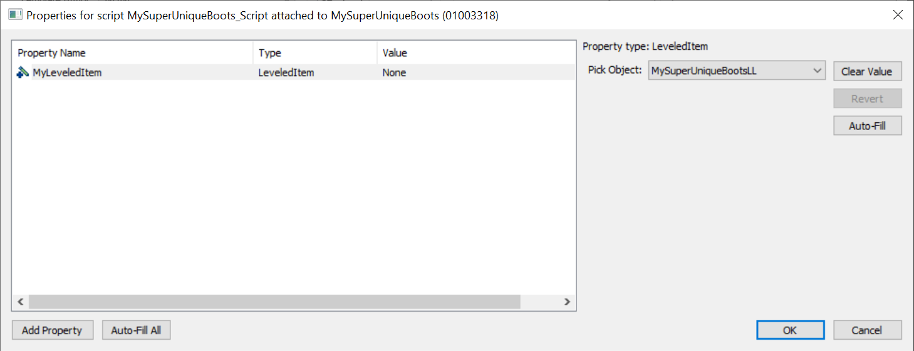

Save your mod and go in game to test, Belethor is now selling the item
and after you purchase it, it doesn’t show in their shop ever again.

Just a note, our script runs anytime the item changes container, for
example if you put the item inside a chest in your home, the script runs
again, and if you take it out, the script runs again because the new
container is the player, the “`SetChanceNone`” command gets called,
again. That is not desirable, Papyrus is very slow and we must minimize
the impact of our script as much as possible. So to that end, we’ll use
[States](https://ck.uesp.net/wiki/States_(Papyrus)),
this is the more optimized script:

    LeveledItem Property MyLeveledItem Auto

    Auto State Waiting

    Event OnContainerChanged(ObjectReference akNewContainer, ObjectReference akOldContainer)

    If akNewContainer == Game.GetPlayer()

    MyLeveledItem.SetChanceNone(100)

    GoToState("Purchased")

    EndIf

    EndEvent

    EndState

    State Purchased

    EndState

By default our script is goes to the “Waiting” state (because of the
Auto we declared for it), then when the purchase happens we use the
GoToState command to put the script in the “Purchased” state, which has
no event listeners in it. That’s the trick!

# Method 3: Using a Quest to spawn the item

Here’s an alternative way to do it, but this method doesn’t require any
modification to existing game records so there’s less need for patching.
We can use a Quest to spawn the item in the merchant itself. For the
purpose of this tutorial I’ve made a unique tomato and I’m going to have
Carlotta (the food merchant in Whiterun) sell it:

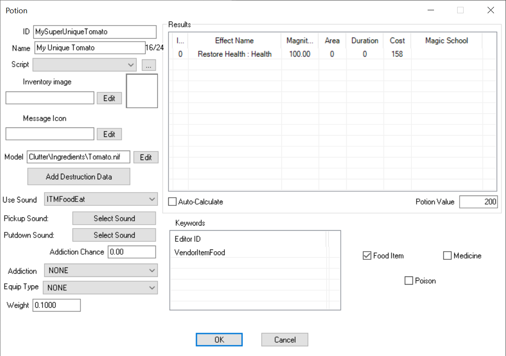

Let’s get started! We need to have a quest first, so add a new one, give
it a unique ID and a name, make sure “Start Game Enabled” option is
enabled, then before doing anything else click OK to save it and then
re-open that quest. This is important, you have to save the quest first,
otherwise CK might lose the options you change. Most of the quest
options don’t show before saving it anyway.

Now, go to Quest Aliases tab. “Alias”es are things the quest can refer
to. Anything in game, be it actors (=\> NPCs), objects you can interact
with, a chair, can be an alias that the quest can point to it, and then
do something with it. Quests can also create them at runtime, meaning we
can tell the quest we want a reference to “that object” and the quest
will create that object for us. That’s what we’re going to do with our
tomato. First, we need a reference to Carlotta herself. So right click
and select New Reference Alias. In the window that opens, give your
alias a name. Carlotta is a unique NPC, there’s only one of her in the
game, that makes our job easier to find her, tick the Unique Actor box
and in the dropdown in front of it, select CarlottaValentia:

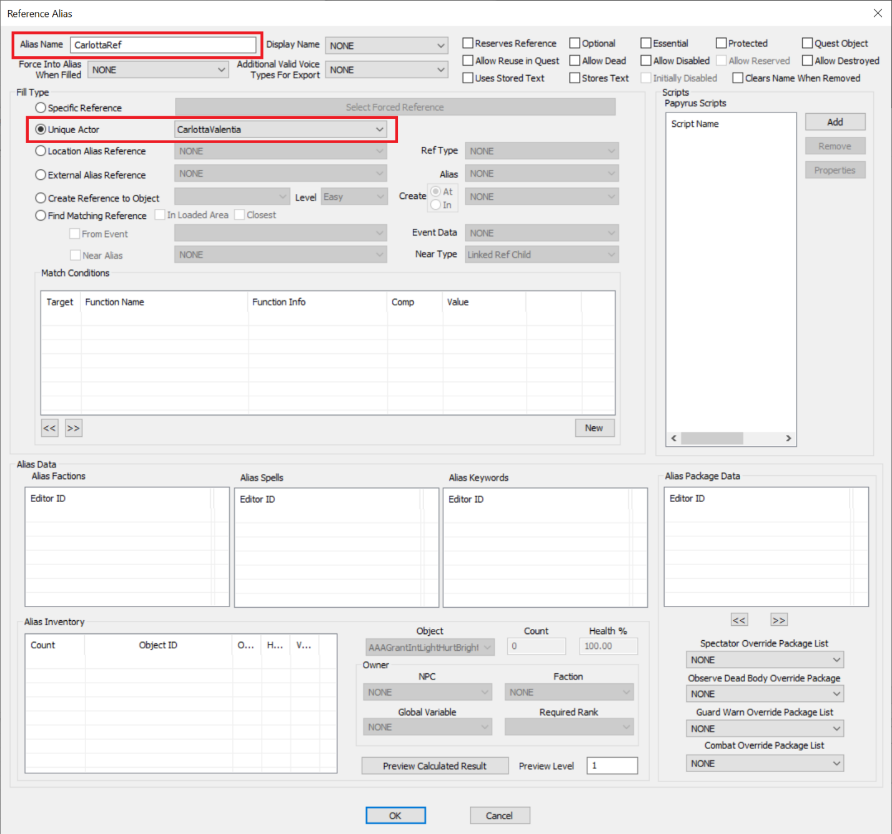

Now we need to create an alias for our tomato, this time select the
“Create Reference to Object” option, in the dropdown in front of it pick
the tomato object, choose “Create In” and lastly select that Carlotta
reference we made earlier:

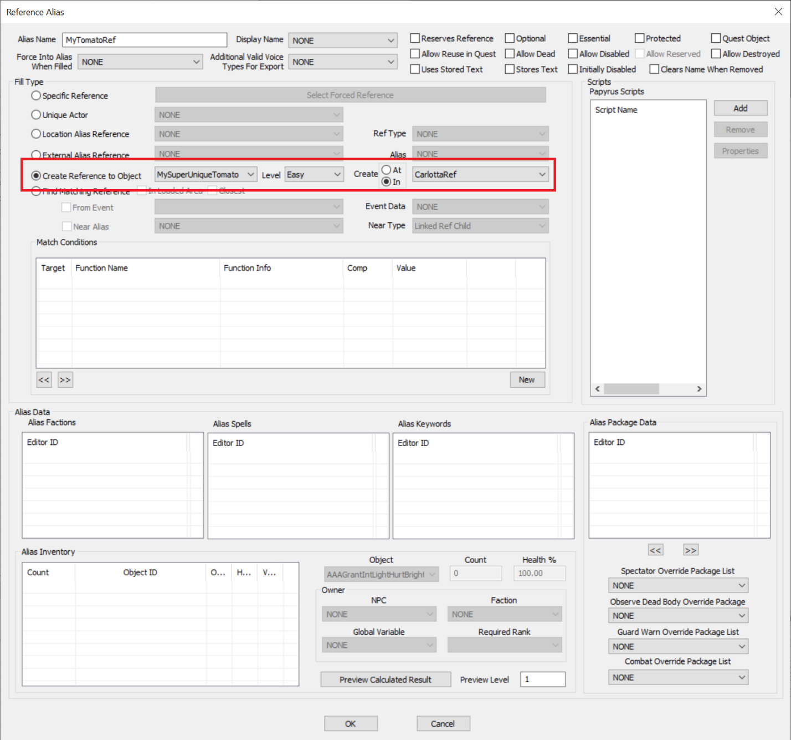

What’s happening is the game spawns the selected object “In” the alias
we picked (here: “CarlottaRef” reference).

This is all there’s to it, however, we don’t need the quest to hang
around anymore (it consumes precious memory), so why don’t we terminate
the quest after the player purchases the item? To do that add an script
to MyTomatoRef:

    Scriptname MyUniqueTomato_Script extends ReferenceAlias

    Event OnContainerChanged(ObjectReference akNewContainer, ObjectReference akOldContainer)

    If akNewContainer == Game.GetPlayer()

    GetOwningQuest().Stop()

    EndIf

    EndEvent

This script is even simpler than we had before, we still listen for
`OnContainerChanged` event to run our code once the player purchases the
item, but this time all we need is to get the quest itself using
`GetOwningQuest()` (meaning, get the quest object that owns this
reference) and call `Stop()` method on it. This will terminate the quest
and removes the aliases from memory, so our code no longer runs. We
don’t need extra steps to stop the script from running every time our
item changes container. Capital!

# Help! Item doesn’t appear in shop!

So you’ve used any of the methods above and the item isn’t showing up in
shop? This might be because that vendor doesn’t sell the type of item
you’ve given them. In Skyrim each vendor has a list of items that they
can buy/sell and if you give them an item that doesn’t match their list,
they don’t sell/buy that. Alchemy shops only deal with
Ingredients/Potions, Smiths sell weapon and armor, etc. So if our unique
item doesn’t match what they usually sell, we have to fix that.

First, find that merchant’s Vendor Faction (see Method 1 for that). In
the Vendor tab find the Vendor Buy/Sell List:

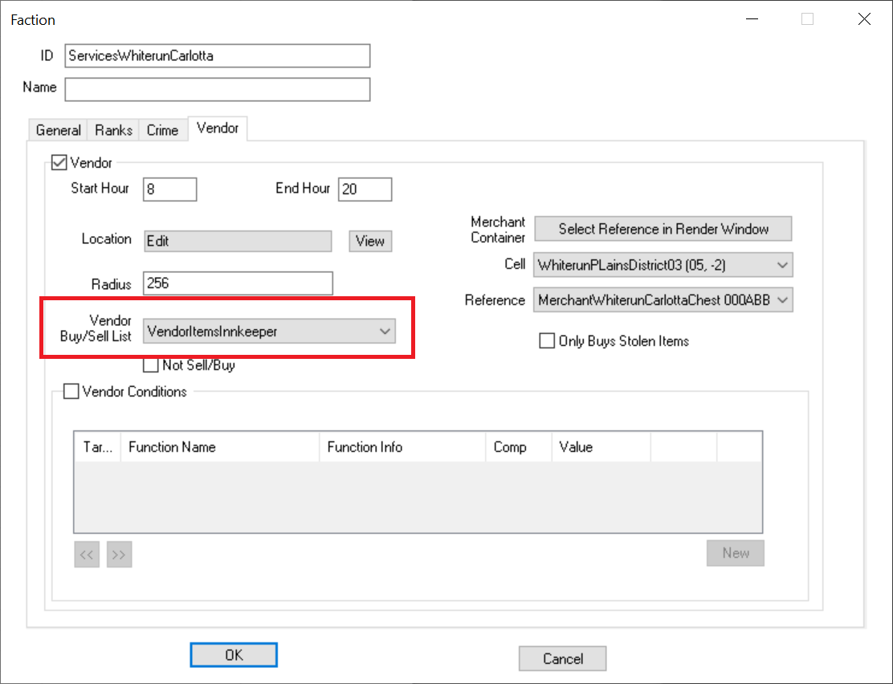

This vendor is using VendorItemsInnKeeper. This is a FormList of
keywords, any item that has a keyword present in that list, will show up
for sell/buy. So in this example, the VendorItemsInnKeeper has two
keywords:

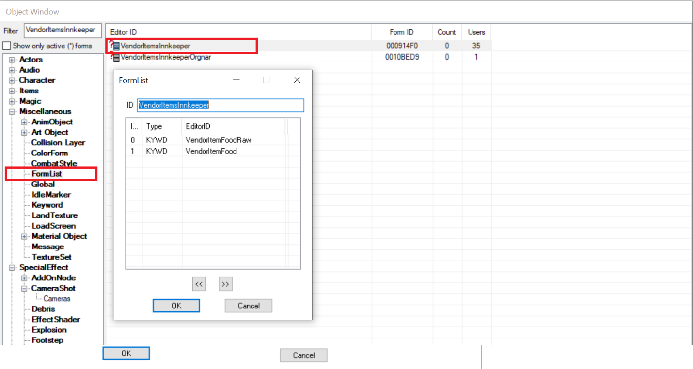

That means our item that we’re trying to have her sell, must have one of
these two keywords. Say I want an innkeeper to sell a book, I have to
give that book one of those two keywords:

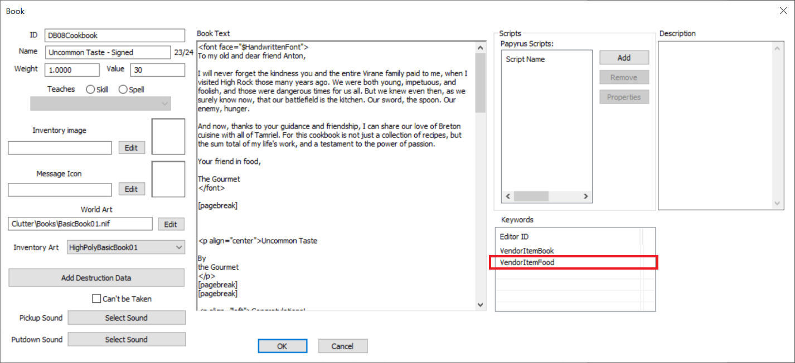

By giving the book item the “VendorItemFood” keyword, innkeepers can now
buy or sell it. Except, this is not a good idea. Keywords are used for
all sorts of things, our book is not a food item to give it
“VendorItemFood” keyword. A better option would be to create a custom
keyword, and then add that keyword to the VendorItemsInnKeeper FormList.
This poses a new problem however. What happens when another mod modifies
the same FormList? We’d need to create a patch to make our mods
compatible. This is where [FormList
Manipulator](https://www.nexusmods.com/skyrimspecialedition/mods/74037)
mod comes in. FLM enables us to modify FormLists, without touching the
formlist itself. We can add or remove stuff from formlists via an .ini
file that we include with our mod.

So first create the keyword:

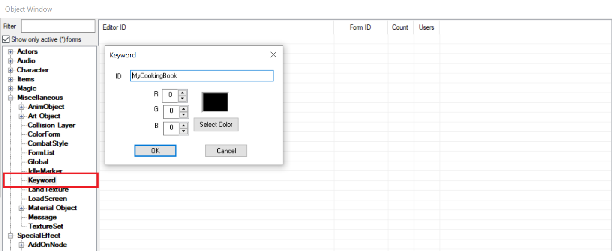

Next create an .ini file inside the root folder of your mod (where your
.esp file is located). Name the file the same as your mod, but end the
filename with “\_FLM.ini”. My mod’s name is “Unique Items.esp” so I’ll
name the file “Unique Items_FLM.ini”. Now open the file and inside it
add:

    FormList = VendorItemsInnKeeper|MyCookingBook

The format is very east to read. First, `FormList =` is always there,
for every new keyword we make a new line and put `FormList =` in the
beginning. Next, we type the FormList’s editor ID, followed by `|`
character, followed by the keyword’s editor ID. This means when the game
loads, the FLM mod adds the MyCookingBook keyword to the
VendorItemsInnKeeper FormList, and this doesn’t cause any conflict
because we do not edit the game’s record directly! Marvelous! Just make
sure you don’t forget to add that keyword you created to your item.

# Perk to reduce the price of unique items

The Speech skill tree does bupkis in the vanilla game, so let’s spice it
up, have a perk that slashes the price of unique items, so players that
invest in Speech skill and get the perk will be able to buy the uniques
at much lower prices. Now, we can’t have a perk change the price of
specific items, so for this we need to write an script, and to run some
scripts when player gets a perk we need to add an Ability, which is a
type of spell.

First, add a Magic Effect, set the Archetype to Script since that’s all
our MagicEffect is for, and set the Casting Type to Constant Effect. You
can enable No Magnitude, No Duration, No Area since this effect doesn’t
apply or change anything to player. Enable the Hide in UI option, so
this doesn’t show up when player opens the Magic \> Active Effects menu:

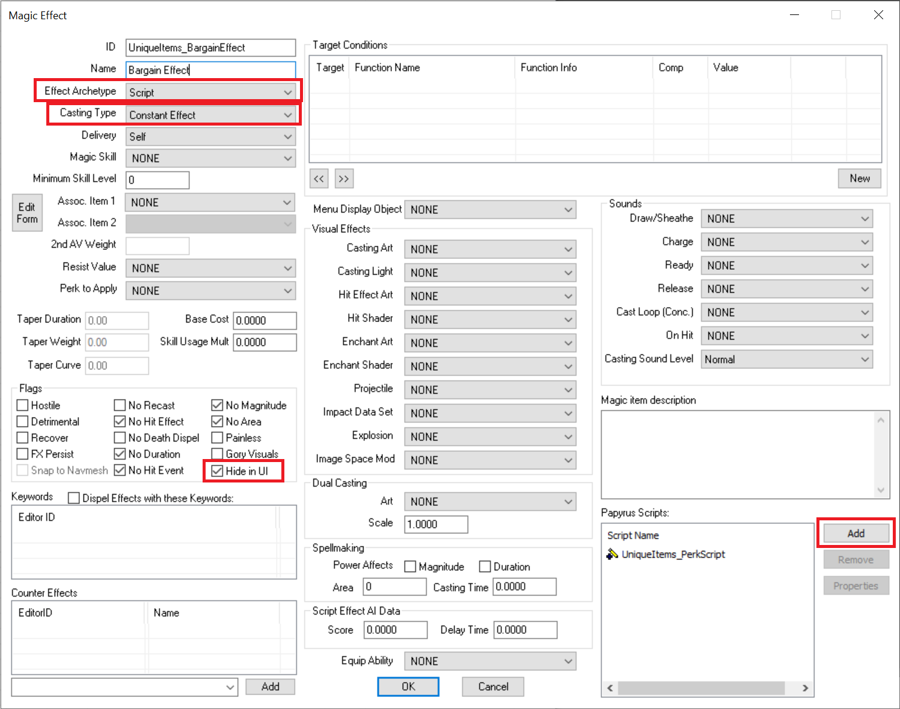

Add a spell to attach this MagicEffect to, set the Type to Ability and
Casting to Constant Effect:

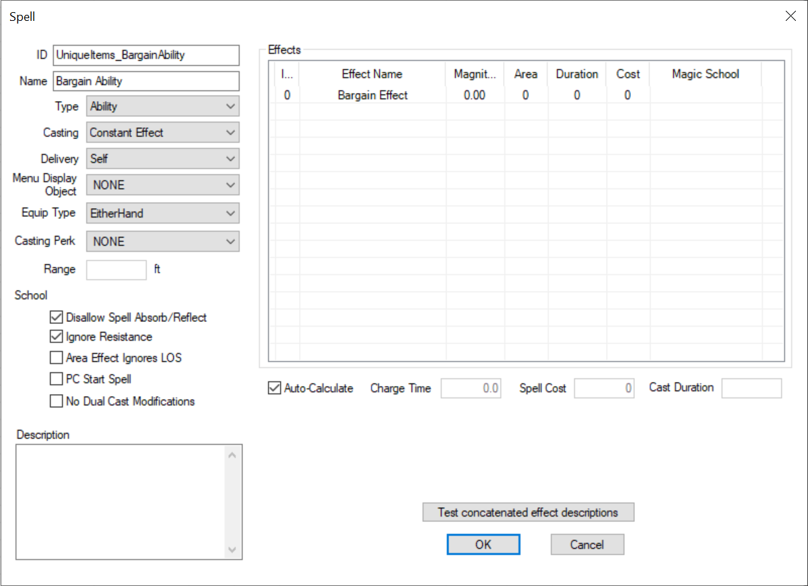

Next add the perk, for me I want this to apply when the player gets the
first rank of the Haggling perk (first perk in the Speech tree) so edit
that and add a new entry, enable the Ability radiobox and set the
dropdown to that Ability spell we created earlier:

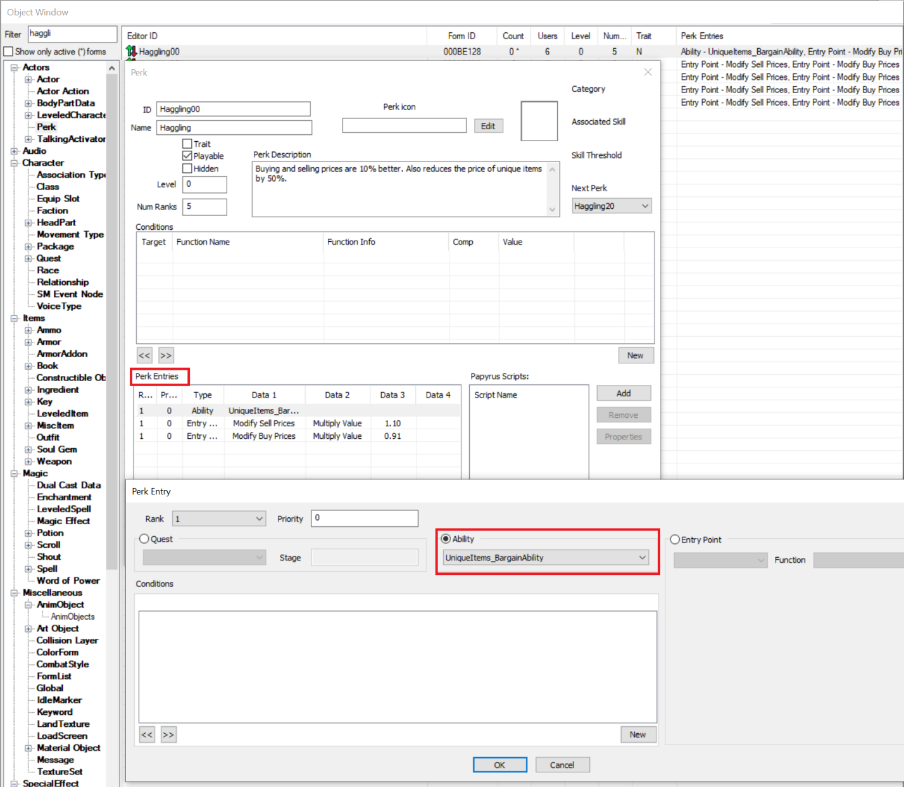

Since I’m editing a vanilla perk I also edited the perk description to
reflect the new effect. What happens now is, when the player takes the
perk the Ability is added to the player, the Ability applies the
MagicEffect, and the MagicEffect has an script that runs and does stuff.

Now, we might have a multitude of unique items, maybe one for every
shop, so we need to have a list of those so our script can loop through
them and update their price. To that end, make a FormList and add all
the unique items into it:

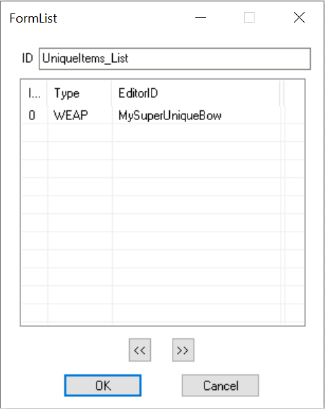

Time to add script that actually changes the prices. If you want, you
can copy the UniqueItems_PerkScript script attached to this tutorial
onto your mod (note that if you paste the files while CK is open, you
need to restart CK in order to load those), so you don’t have to write
it yourself. So, edit the MagicEffect we added, now under Papyrus
Scripts section click Add button and add UniqueItems_PerkScript. Now
right click on the script and select Edit Properties. Think of
Properties as “configuration parameters” for the script. This one, has
two:

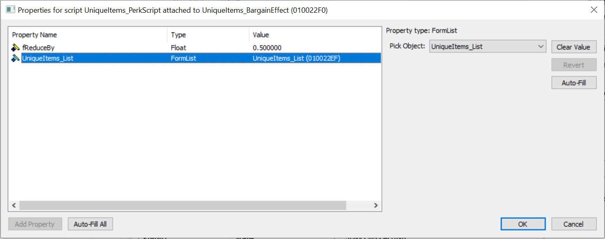

UniqueItems_List must be set to the FormList we created, and fReducedBy
by the price multiplier we want to apply, 0.5 means half, so after this
script runs, the price of the items inside that FormList gets halved.

This is all that’s needed. If you’re wondering what the script does,
this is all of it:

    Scriptname UniqueItems_PerkScript extends activemagiceffect

    FormList Property UniqueItems_List Auto

    Float Property fReduceBy Auto

    Event OnEffectStart(Actor akTarget, Actor akCaster)

    Int i = UniqueItems_List.GetSize()

    While i > 0

    i -= 1

    UniqueItems_List.GetAt(i).SetGoldValue( ( UniqueItems_List.GetAt(i).GetGoldValue() * fReduceBy ) as Int )

    EndWhile

    EndEvent

So basically when the `OnEffectStart` happens (when the MagicEffect is
applied), use `GetSize()` to find how many items we have in our
FormList, then run a loop on it and use `SetGoldValue` to change its
price. Note that `SetGoldValue` doesn’t exist in vanilla game and
requires SKSE.

And that’s all.
